<!--  -->

### Développement d'applications Android

Laboratoire Android 1 : Une introduction à Android

<span style="color:gray"></span>

<span style="color:gray">SEG 2505 - Introduction au génie logiciel</span>

<span style="color:gray">Automne 2017</span>

<span style="color:gray">Présenté par : Cédric Clément</span>


<!-- ### Laboratoire Android 1 -->


<!--<span style="color:gray">À compléter : une calculatrice sur Android</span>-->


<!-- +++ -->

---

#### Plan

<!-- - Guide d'installation -->
<!-- - Installation du projet -->
<!-- - Configuration du simulateur Android -->
<!-- - Configuration de l'interface usager -->
    
1. Introduction
2. Android Studio
3. Concepts de base
4. Travail de laboratoire : une calculatrice

<span style="font-size:0.6em;color:gray">Appuyez sur la clé <span style="color:#3884b9">**O**</span> pour voir un survole de la présentation.</span>

---

### Introduction

+++

### Qu'est-ce Android ?

- Platforme la plus populaire au monde
- Cadriciel (Framework) puissant
    - Les outils de développement Android offrent l'environnement de développement intégré de Java (Java IDE) ainsi que les outils nécessaires pour le développement, "debugging" et "packaging" d'applications Android
- Accès au marché pour rendre disponibles vos applications après un enregistrement de 25$

Note:
Les outils de développement Android offrent l'environnement de développement intégré de Java (Java IDE) ainsi que les outils nécessaires pour le développement, "debugging" et "packaging" d'applications Android

+++

### Versions d'Android

<!--
Ice Cream Sandwich | Jelly Bean | KitKat | Lollipop | Marshmallow | Nougat
--- | --- | --- | --- | --- | ---
4.0 - 4.2 (14-15) | 4.1 - 4.3.1 (16-18) | 4.4 - 4.4.4 (19-20) | 5.0 - 5.1.1 (21-22) | 6.0 (23) | (24)
Majeur | Mineur | Majeur | Majeur | Majeur | Majeur
-->

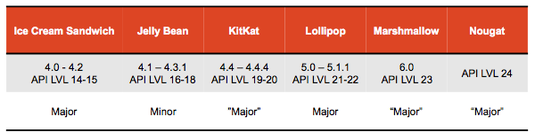

Chaque version d'Android introduit de nouvelles fonctionnalités. Certaines itérations se concentrent sur des optimisations et d'autres sur l'architecture du système.

+++

### Android SDK

- Les outils de développement logiciel Android vous donnent accès aux libraires et aux outils nécessaires pour construire, tester, et débugger vos applications Android.
- http://developer.android.com/sdk/index.html
- Outils disponibles
    - Android Studio (IntelliJ IDEA)
    - La ligne de commande (Debug et émulation)

+++

### Fonctionnement d'Android

- <span style="font-size:0.6em;color:gray">Android est exécuté sur une couche du Kernel de Linux</span>
- <span style="font-size:0.6em;color:gray">Les applications Android demeurent, et son exécuté dans leurs <span style="color:#00aa60">propres environnements</span> / machine virtuelle (Sandbox)</span>
- <span style="font-size:0.6em;color:gray">Depuis la version KitKat (4.4), l'environnement d'Android se sert d’ART (Android RunTime), Dalvik auparavant</span>
- <span style="font-size:0.6em;color:gray">Les applications Android sont basées sur des <span style="color:#3884b9">Activités</span></span>
    - <span style="font-size:0.6em;color:gray">une activité représente <span style="color:orange">une chose que l'on fait</span>, tel qu'une recherche</span>
    - <span style="font-size:0.6em;color:gray">les applications sont composées de <span style="color:#a1617a">plusieurs activités</span></span>

+++

### Quelques Rappels : Les tests

- <span style="font-size:0.6em;color:gray">Windows</span>
    - <span style="font-size:0.6em;color:gray">Voir la documentation OEM USB Drivers pour l'installation de composantes nécessaire</span>
    - <span style="font-size:0.6em;color:gray">MTP : Media Transfer Protocol</span>
- <span style="font-size:0.6em;color:gray">Mac OS</span>
    - <span style="font-size:0.6em;color:gray">Android File Manager</span>
    - <span style="font-size:0.6em;color:gray">PTP : Picture Transfer Protocol</span>
    
+++

- <span style="font-size:0.6em;color:gray">Vous devez activer le mode développement sur les mobiles</span>
    - <span style="font-size:0.6em;color:gray">l'option est cachée par défaut </span>
        - <span style="font-size:0.6em;color:gray">Android 3.2  : Settings > Applications > Development</span>
        - <span style="font-size:0.6em;color:gray">Android 4.0+ : Settings > Developer options</span>
        - <span style="font-size:0.6em;color:gray">Android 4.2+ : Settings > About phone, tapez sur Build number 7 fois, retournez à l'écran d'avant pour trouver Developer options.</span>

---

<!-- ### Création d'un projet -->


### Android Studio

+++

### Installation


- Les systèmes du laboratoire ont déjà Android Studio<!--  d'installé -->
- Téléchargez <!-- et installez Android Studio --> et acceptez continuellement
<!-- - Sélectionnez votre interface -->
<!-- - Faites une mise à jour -->

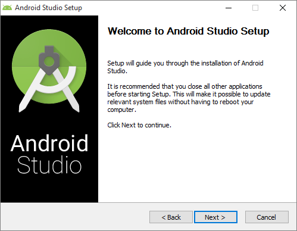

<!-- +++ -->

<!-- ### Installation... -->

+++

### Notez bien

- Certains systèmes fonctionnent mieux qu'autre
    <!-- - Windows Surface Pro : vous êtes limités par l'interface -->
    <!-- - QHD et moniteurs 4K : l'interface peut avoir de la misère  -->
- Certains systèmes se ralentissent lors de l'exécution de l'émulateur
    - les systèmes avec des CPU autres que Intel, aucune accélération (Intel Hardware Acceleration)
    - Tablet : limité par le processeur
<!-- - autres options -->

---

### Une première application
<span style="color:#a1617a">Hello World</span>

+++
<br>
Sélectionnez "Start a New Android Studio project"

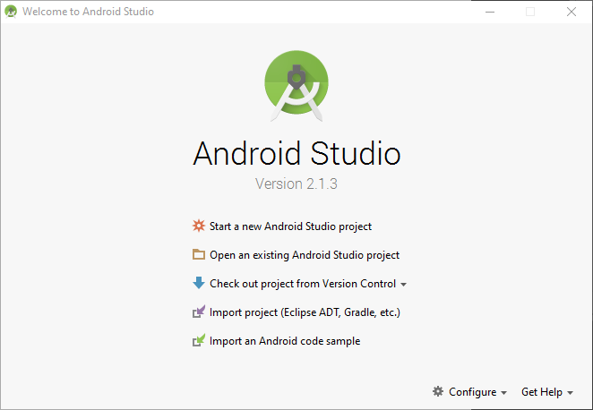


+++

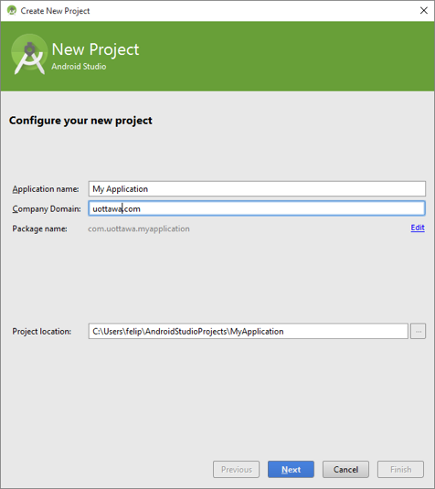

+++
Nom du projet
- Le domaine du groupe de développement
- Le nom du développeur est généralement basé sur la hiérarchie renversée .com <!-- où [code du pays].[TLD].[nom de l'entreprise].[sous-domaine].[équipe] tel que dans br.com.firasoft.msp.jimmyfive -->
- Nom du paquet <!-- tel que montré sur le marché Google (Google Play Store) -->

+++

Le code du pays, sous-domaine, nom d'équipe sous optionnels, mais aide avec la structure.


Le nom du paquet est produit à partir du nom de l'application ainsi que du domaine de la compagnie.

Vous pouvez modifier le nom du paquet (package name) si nécessaire

+++

<span style="font-size:0.6em;color:gray">Utilisez <span style="color:orange">API LVL 15 </span>pour le tutoriel</span>

<span style="font-size:0.6em;color:gray">Après avoir appris la base, vous pouvez <span style="color:#00aa60">développer</span> et <span style="color:#a1617a">publier</span> des applications pour plusieurs versions d'Android.</span>


+++

#### Gabarit d'activité

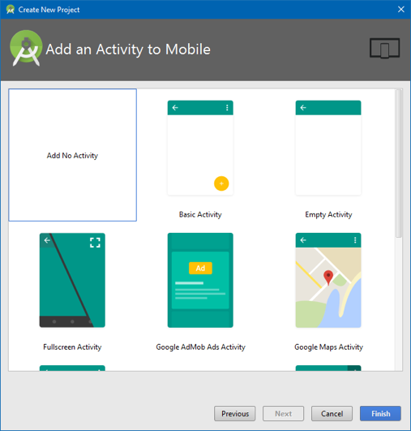

+++

<span style="color:gray">Il y a plusieurs types d'activité qui viennent avec des éléments d'interface de base</span>

Pour cet exercice, <span style="color:orange">sélectionnez</span> "EMPTY Activity"

<span style="color:gray">Plus d'activité devient disponible avec des versions plus élevées du cadriciel (API LVL). Un exemple de ceci sont les Applications à plein-écrans de ou le support est arrivé que dans la version 4.4 du cadriciel.</span>

+++

<span style="color:gray">Vous pouvez configurer le nom de vos activités. Notez que ceci a une influence que sur les aspects de développement et ne sont pas visible aux utilisateurs.</span>

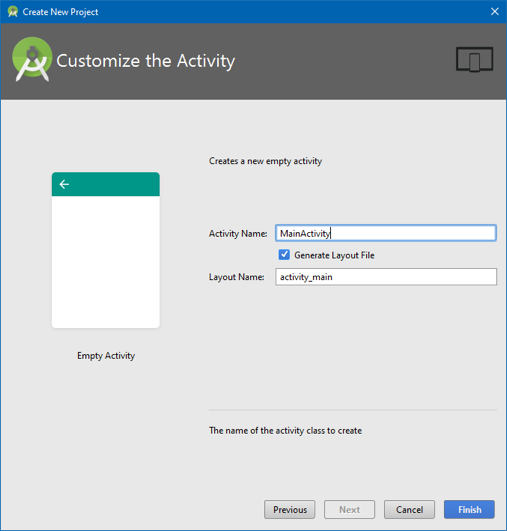


+++

<span style="color:gray">Ceci est une opportunité pour vous d'appliquer la matière apprise en classe.</span>

<span style="color:gray">Par défaut, Java utilise la convention "Capitalized Camel Case" (UneClasse) comme standard pour les classes/interfaces, mais "Camel Case" (uneMethode) pour les méthodes et les variables. Visitez le [site d'Oracle](http://www.oracle.com/technetwork/java/codeconventions-135099.html).</span>

Note:
<span style="color:gray">Par défaut, Java utilise la convention "Capitalized Camel Case" (UneClasse) comme standard pour les classes/interfaces, mais "Camel Case" (uneMethode) pour les méthodes et les variables. Visitez le site d'Oracle pour plus de détails : http://www.oracle.com/technetwork/java/codeconventions-135099.html.</span>


+++

#### L'interface graphique d'Android Studio

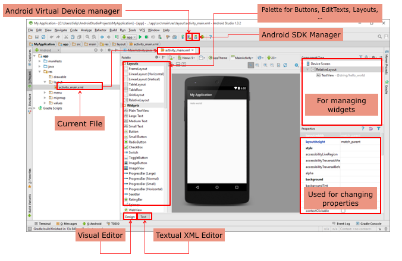

<!--
- Gestionnaire de machine virtuelle
- Gabarits d'éléments visuels
- fichier présent
- éditeur visuel
- éditeur XML
- pour la gestion de Widgets
- pour la gestion des propriétés
-->

---

### L'interface d'Android Studio 2.2

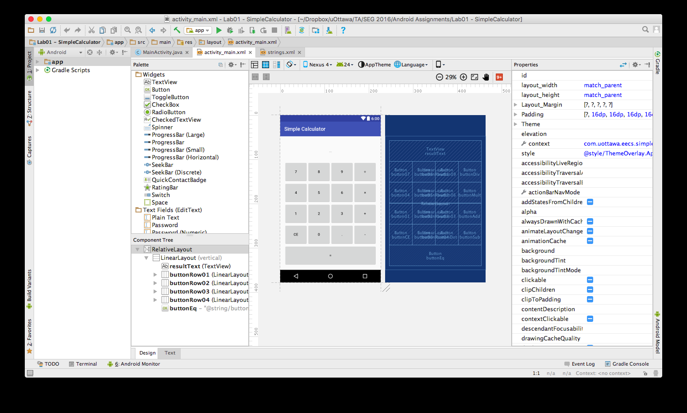


+++
### Machine virtuelle Android (AVD)

Une machine virtuelle Android est une configuration d'émulateur qui vous permet de choisir un modèle d'un système Android

1. une vue des systèmes matériaux <!-- du téléphone --> tel que la présence d'une caméra.
2. une vue des systèmes logiciels <!-- du système --> tel que la version d'Android
3. un environnement dédié pour le stockage d'information <!-- sur votre système -->
4. Autres options : l'apparence de l'émulateur

+++

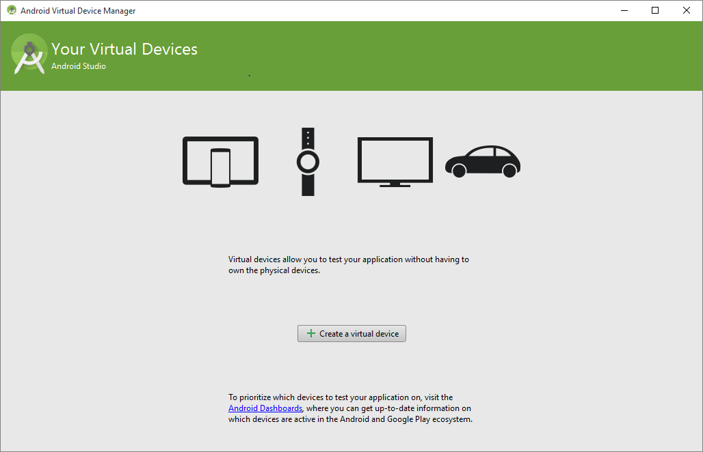

+++

Sélectionnez Windows > AVD Manager ou appuyer sur l'icône AVD Manager dans la barre d'outils d'Éclipse.

Appuyez sur "+" pour créer un nouveau gestionnaire AVD


<!-- +++ -->

+++

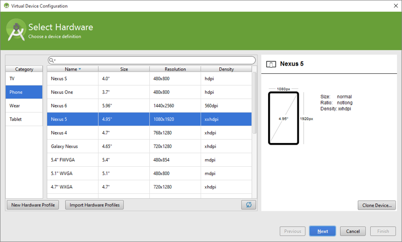
<span style="font-size:0.6em;color:gray">Sélectionnez un système appartenant à la liste ou créez le vôtre en appuyant sur "New Hardware Profile".</span>

+++

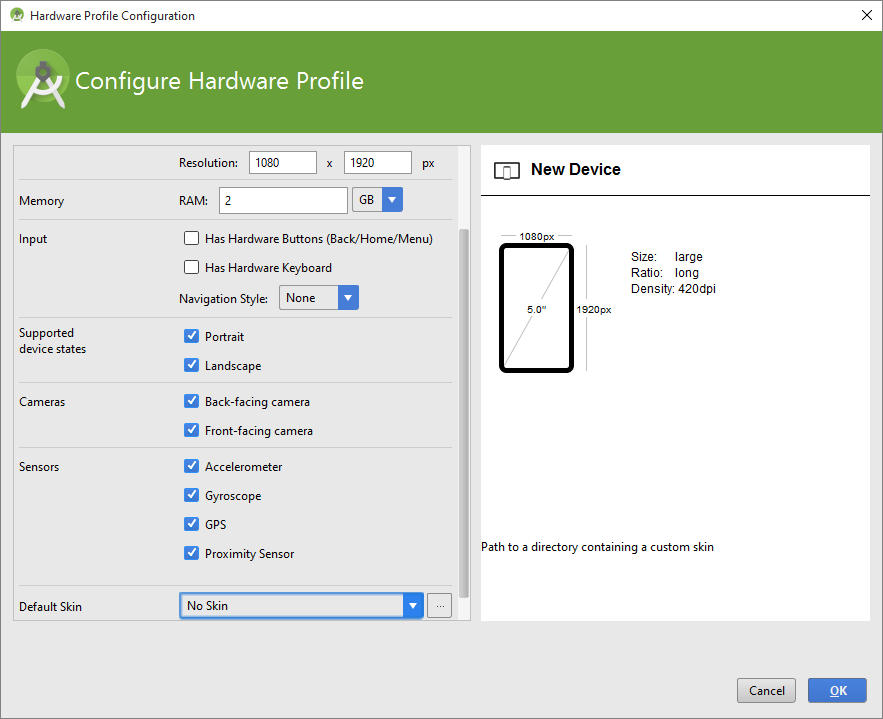


+++

### Gestion d'AVD

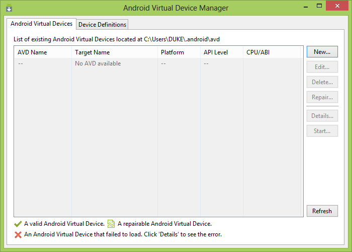

- <span style="font-size:0.6em;color:gray">Sélectionnez Windows > AVD Manager ou appuyer sur l'icône AVD Manager dans la barre d'outils d'Éclipse.</span>
- <span style="font-size:0.6em;color:gray">Appuyez sur "New" pour créer une nouvelle machine virtuelle</span>

+++

### Gestion d'AVD (cont.)

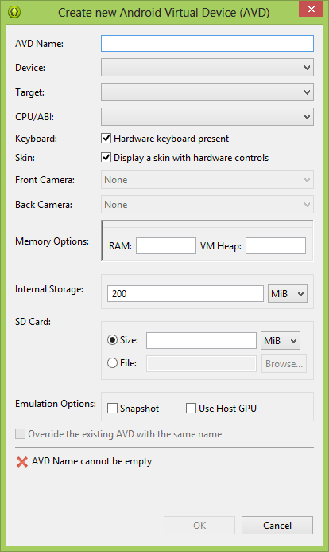

+++

- Remplissez les détails pour votre gestionnaire, appuyez sur "OK"
- Les systèmes qui ont plus de fonctionnalités sont plus demandant 
- Sélectionnez "AVD Name" dans la liste et appuyez sur "Start"
- Soyez patient(e)

+++

### Contraintes de système

Certains systèmes sont limités en ce qui concerne le pouvoir qu'il vous offre. Si vous éprouvez des difficultés avec l'émulation d'un système virtuel vous pouvez:

- changer l'architecture à "x86" ou à "armeabi-v7". Appuyez sur l'icône de crayon.
- désélectionner "User Host GPU"
- réduire le montant de RAM qu'utilise l'émulateur (Advanced Settings)

+++

### L'émulateur Android

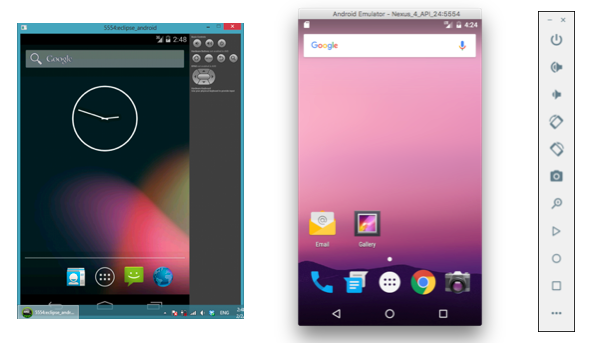


+++

### Notes

- Autre émulateur (Bluestack, Genymotion, Nox, MEmu)
- Vous avez besoin de l'accélération d'Intel HAXM si votre système fonctionne sur une architecture x86.
- Vous allez avoir accès à un Google Nexus 4 pour le déploiement de votre application

---

### Concepts de base 


+++

### Ce qu'offre Android

- Des composantes déjà construites
- Des modules tels que les dialogues, les menus ainsi que les notifications
- Déclaration d'interfaces à partir de code XML et/ou source


Note:
- Des composantes déjà construites telles qu'une structure d'objet et des contrôles d'interface (UI)
- Des modules tels que les dialogues, les menus ainsi que les notifications
- Un mécanisme pour déclarer vos interfaces à partir de code XML et/ou source
    - facile et rapide pour la gestion et la création d'interfaces
    - séparation de l'aspect logique de l'aspect présentation
    - réutilisable
    - accessible
    - facile à comprendre

+++

### La hiérarchie de l'interface usager

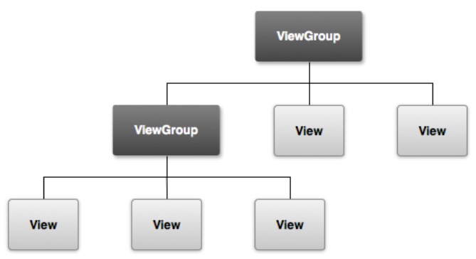

<span style="color:#a1617a">ViewGroups</span> <span style="font-size:0.6em;color:gray">(contenant/invisible) </span>et <span style="color:orange">Views</span> <span style="font-size:0.6em;color:gray">(composante/visible)</span>

Note:
- <span style="font-size:0.6em;color:gray">ViewGroups (contenant/invisible) sont des éléments fonctionnels utiles pour l'organisation d'interface</span>
- <span style="font-size:0.6em;color:gray">Les Views (vues) sont eux aussi des objets visibles sur l'écran tel que des boîtes de texte, des boutons, etc.</span>

+++

### Layouts

<span style="color:gray">Ce sont ce qui définit la <span style="color:orange">structure</span> de l'interface</span>

<span style="color:gray">Peuvent être déclarés avec un fichier <span style="color:#a1617a">XML ou avec le code source</span></span>

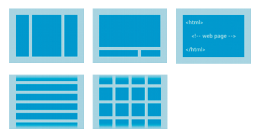


Note:
- Ce sont ce qui définit la structure de l'interface
- Peuvent être déclarés avec un fichier XML ou avec le code source
- Layouts commun
    - Linear
    - Relative
    - Web view
    - ListView
    - GridView

+++

Contrôle d'entrées

- <span style="color:gray">Android vous offre plusieurs sources d'entrée (I/O.)</span>
- <span style="color:gray">Vous pouvez construire vos propres composantes</span>

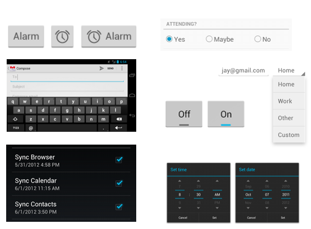


Note:
- Android vous offre plusieurs sources d'entrée (I/O.)
- Vous pouvez construire vos propres composantes
- Des composantes communes
    - Button
    - Text field
    - Checkbox
    - Radio button
    - Toggle button
    - Spinner
    - Pickers

---

<!-- Livrable du lab -->
<!-- Une calculatrice simple -->

<!-- +++ -->

<!-- ### L'interface d'Android Studio -->

### Travail de laboratoire

- <span style="color:gray">L'objectif est d'<span style="color:orange">apprendre à utiliser les outils</span> qui vous sont disponibles</span>
- <span style="color:gray">Pour ajouter un objet à l'interface, appuyez et tenez sur une composante et amenez-la <span style="color:#ff0000">dans l'arbre des composantes</span>. N’amenez JAMAIS une composante <u>directement</u> à l'interface visuelle.</span>

<br>
#### <span style="color:orange">Montrez la calculatrice avant de quitter</span>


Note:
- L'objectif est d'apprendre à utiliser les outils qui vous sont disponibles
- Votre application n'a pas besoin d'être exactement comme celle démontrée ici, mais les fonctions de base d'une calculatrice doivent être implémentées
- Pour ajouter un objet à l'interface, appuyez et tenez sur une composante et amenez-la dans l'arbre des composantes. N’amenez JAMAIS une composante directement à l'interface visuelle.
- Montrez la calculatrice avant de quitter

+++

### Calculatrice

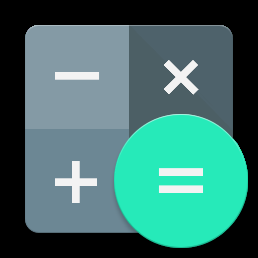

---

### Positionnement

1. <span style="font-size:0.6em;color:gray">Suivez les étapes dans le premier exemple pour créer une application. Nommez votre application "Simple Calculator".</span>
2. <span style="font-size:0.6em;color:gray">Enlever le TextView "Hello World" si votre Layout n'est pas vide.</span>
3. <span style="font-size:0.6em;color:gray">Ajoutez un champ EditText au Layout nommé MainLayout et changez le champ ID à "resultEdit".</span>
4. <span style="font-size:0.6em;color:gray">Ajouter un Layout "Layout (Vertical) / VerticalLayout" sous "resultEdit" et assignez l'ID du nouveau Layout à "mainLayout".</span>
5. <span style="font-size:0.6em;color:gray">Changez la propriété "layout:width" du Layout "resultEdit" à "fill_parent". Ceci fera que ce Layout aura une valeur de x dynamiques.</span>

Note:
1. Suivez les étapes dans le premier exemple pour créer une application. Nommez votre application "Simple Calculator".
2. Enlever le TextView "Hello World" si votre Layout n'est pas vide.
3. Ajoutez un champ EditText au Layout nommé MainLayout et changez le champ ID à "resultEdit".
4. Ajoutez un Layout "Layout (Vertical) / VerticalLayout" sous "resultEdit" et assignez l'ID du nouveau Layout à "mainLayout".
5. Changez la propriété "layout:width" du Layout "resultEdit" à "fill_parent". Ceci fera que ce Layout aura une valeur de x dynamiques.

+++

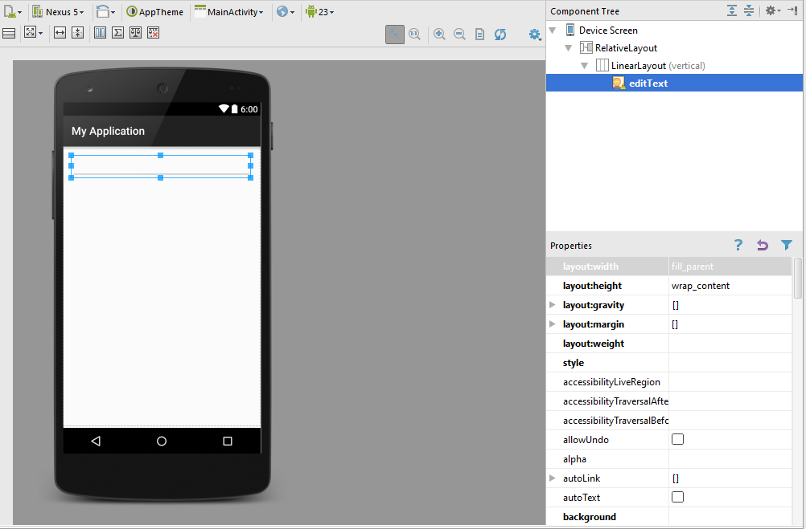


---

### Les boutons

1. <span style="color:#a1617a">Ajoutez</span> un `HorizontalLayout` à votre `VerticalLayout` existant et nommez le `ButtonsLayout01`
2. <span style="color:#3884b9">Ajoutez</span> 4 boutons au `HorizontalLayout`
3. <span style="color:orange">Renomez</span> chaque ID à `btn0X` ou `X` est le numéro du bouton (premier est "btn01", deuxième "btn02", etc.)

<span style="font-size:0.6em;color:gray">Si vous remarquez que certains boutons ne sont pas de la même largeur qu'autres, changez la propriété `layout:weight` à une valeur de `1` et faites-le pour chaque bouton.</span>

<span style="font-size:0.6em;color:gray">Les boutons auront maintenant la même priorité pour l'espace.</span>


Note:
1. <span style="color:#a1617a">Ajoutez</span> un `HorizontalLayout` à votre `VerticalLayout` existant et nommez le `ButtonsLayout01`
2. <span style="color:#3884b9">Ajoutez</span> 4 boutons au `HorizontalLayout`
3. <span style="color:orange">Renomez</span> chaque ID à `btn0X` ou `X` est le numéro du bouton (premier est "btn01", deuxième "btn02", etc.)

Il ce peut que vous remarquez que certains boutons ne sont pas de la même largeur qu'autres. Pour réparer ceci, changez la propriété `layout:weight` à une valeur de `1`. Faites ceci pour chaque bouton.

Les boutons auront maintenant la même priorité pour l'espace.

+++


<!-- ### Calculatrice simple : résultat de l'étape 02 -->

+++

<span style="color:gray"><span style="color:orange">Répétez</span> les étapes retrouvées dans la diapositive intitulée "les boutons" jusqu'à ce que vous avez une matrice de 4x4 boutons.</span>

+++

<span style="font-size:0.6em;color:gray">Si vous remarquez que la prochaine rangée de boutons a aussi des problèmes avec le partage d'espace, changez la valeur de la propriété "layout:weight"  au HorizontalLinearLayout à 1.</span>

2. <span style="font-size:0.6em;color:gray">Ajoutez des boutons fonctionnels (+ - = x ...) sous la dernière rangée de HorizontalLinearLayout</span>
3. <span style="font-size:0.6em;color:gray">Changez la propriété "layout:width" du HorizontalLinearLayout à "fill_parent"</span>

<span style="font-size:0.6em;color:gray">Pour remplir les espaces entre chaque bouton, changez leurs propriétés "layout:height" à "fill_parent".</span>

+++

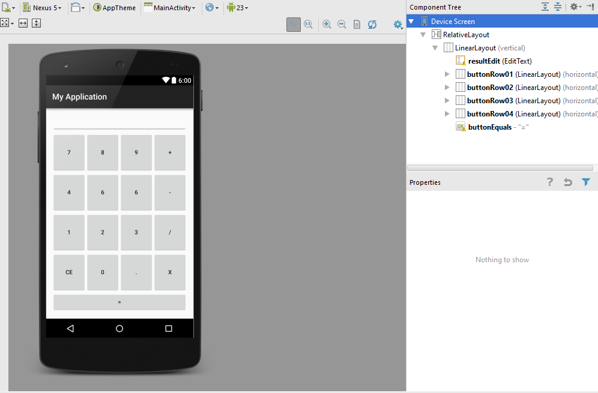


<!-- ### Calculatrice simple : résultat de l'étape 03 -->

<!-- Rappel : ce que vous avez n'a pas besoin d'être exactement comme ceci -->

+++

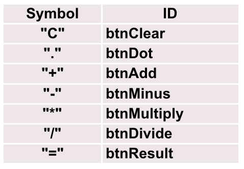

- <span style="font-size:0.6em;color:gray"><span style="color:orange">Changez</span> les valeurs du texte que présentent les boutons pour qu'ils ressemblent à ce que vous voyez ici</span>
- <span style="font-size:0.6em;color:gray"><span style="color:orange">Changez</span> les valeurs des ID pour que les boutons suivent une convention telle que `btn00` pour le `0`, `btn01` pour le `1`, etc.</span>

+++

### Boutons (extra)

<span style="color:gray">Vos boutons doivent savoir quelle méthode appeler pour fonctionner.</span>

- <span style="font-size:0.6em;color:gray">chaque bouton doit avoir une propriété `onClick`</span>
    - <span style="font-size:0.6em;color:gray">si vous voulez que le bouton btn01 exécute la méthode `btn01Click()`, la propriété `OnClick` de ce bouton sera `btn01Click`</span>
    - <span style="font-size:0.6em;color:gray">si vous regardez la déclaration textuelle de l'interface et que vous voyez une entrée similaire à `android:onClick="btn01Click"`, le lien entre bouton et méthode a été créé</span>

---

### Étiquettes (Strings)

<span style="color:gray">Pour séparer les noms d'étiquettes du code source qui contrôle l'emplacement des objets:</span>
1. <span style="font-size:0.6em;color:gray">sélectionnez un bouton dans l'arborescence des composantes (component tree)</span>
2. <span style="font-size:0.6em;color:gray">sélectionnez la propriété de texte et appuyez sur l'icône "..."</span>
3. <span style="font-size:0.6em;color:gray">sélectionnez "New Resource"</span>
4. <span style="font-size:0.6em;color:gray">sélectionnez "New String Resource"</span>
5. <span style="font-size:0.6em;color:gray">définissez un nom pour le nouveau bouton (e.g: `button_07`)</span>
6. <span style="font-size:0.6em;color:gray">répétez ces étapes pour chaque bouton</span>


Note:
Pour séparer les noms d'étiquettes du code source qui contrôle l'emplacement des objets:
1. sélectionnez un bouton dans l'arborescence des composantes (component tree)
2. Sélectionnez la propriété de texte et appuyez sur l'icône "..."
3. sélectionnez "New Resource"
4. sélectionnez "New String Resource"
5. définissez un nom pour le nouveau bouton (e.g: "button_07")
6. répétez ces étapes pour chaque bouton

+++

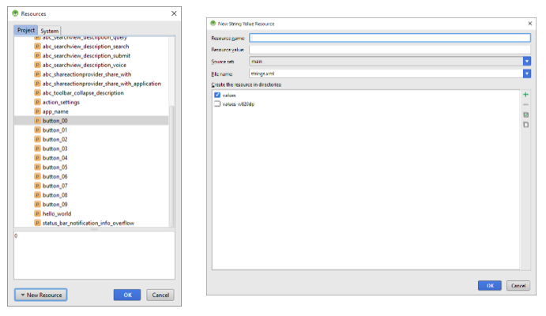


+++

<span style="font-size:0.6em;color:gray">Ajoutez chaque méthode `onClick` dans l'activité principale (MainActivity.java)</span>

```java
    Public void btnGetResult(View view){
        //...
        return results;
    }

```

- <span style="font-size:0.6em;color:gray">n'oubliez pas d'importer les classes nécessaires telles que <span style="color:orange">`android.view.View`</span> et <span style="color:orange">`Android.widget.EditText`</span></span>

- <span style="font-size:0.6em;color:gray">écrivez le code pour chaque bouton</span>

+++

### Example de code

```java
import android.os.Bundle;
import android.app.Activity;
import android.view.Menu;
import android.view.View;
import android.widget.EditText;

public class MainActivity extends Activity {
    private enum Operator {none, add, minus, multiply, divide};
    private double data1 = 0, data2 = 0;
    private Operator optr = Operator.none;
    
    @Override
    protected void onCreate(Bundle savedInstanceState) {
        super.onCreate(savedInstanceState);
        setContentView(R.layout.activity_main);
    }
    
    @Override
    public boolean onCreateOptionsMenu(Menu menu) {
        // Inflate the menu; this adds items to the action bar if present
        getMenuInflater().inflate(R.menu.main, menu);
        return true;
    }
    
    public void btn00Click(View view) {
        EditText eText = (EditText) findViewById(R.id.resultEdit);
        eText.setText(eText.getText() + "0");
    }
    
}

```

@[1-5](imports)
@[8-10](nous avons ajouté ces variables)
@[12-22](cette portion du code est générée automatiquement)

<!-- ### Calculatrice simple : exemple de code 1 -->
<!--  -->
<!-- Nous avons ajouté ces variables -->
<!-- Cette portion du code est générée automatiquement -->

+++

```java
// MainActivity.java

public void btn01Click(View view) {
    EditText eText = (EditText) findViewById(R.id.resultEdit);
    eText.setText(eText.getText() + "1");
}

public void btn02Click(View view) {
    EditText eText = (EditText) findViewById(R.id.resultEdit);
    eText.setText(eText.getText() + "2");
}

// ...

public void btnAddClick(View view) {
    optr = Operator.add;
    EditText eText = (EditText) findViewById(R.id.resultEdit);
}

public void btnMinusClick(View view) {
    optr = Operator.minus;
    EditText eText = (EditText) findViewById(R.id.resultEdit);
    data1 = Double.parseDouble(eText.getText().toString());
    eText.setText("");
}

public void btnMultiplyClick(View view){
    optr = Operator.multiply;
    EditText eText = (EditText) findViewById(R.id.resultEdit);
    data1 = Double.parseDouble(eText.getText().toString());
    eText.setText("");
}

public void btnDivideClick(View view){
    optr = Operator.divide;
    EditText eText = (EditText) findViewById(R.id.resultEdit);
    data1 = Double.parseDouble(eText.getText().toString());
    eText.setText("");
}

public void btnClearClick(View view){
    EditText eText = (EditText) findViewById(R.id.resultEdit);
    eText.setText("");
}

public void btnDotClick(View view){
    EditText eText = (EditText) findViewById(R.id.resultEdit);
    eText.setText(eText.getText() + ".");
}

public void btnResultClick(View view) {
    if(optr != Operator.none){
        EditText eText = (EditText) findViewById(R.id.resultEdit);
        data2 = Double.parseDouble(eText.getText().toString());
        double result = 0;
        if(optr == Operator.add) {
            result = data1 + data2;
        } else if (optr == Operator.minus) {
            result = data1 - data2;
        } else if (optr == Operator.multiply) {
            result = data1 * data2;
        } else if (optr == Operator.divide) {
            result = data1 / data2;
        }
        optr = Operator.none;
        data1 = result;
        if((result - (int) result) != 0)
            eText.setText( String.valueOf(result) );
        else
            eText.setText( String.valueOf( (int) result ) );
    }
}

public void onClickNumericalButton (View view) {
    int pressID = view.getId();

    TextView curText = (TextView) findViewById(R.id.resultEdit);

    switch (pressID) {
        case R.id.btn00:
            curText.setText(curText.getText() + "0");
            break;
        case R.id.btn01:
            curText.setText(curText.getText() + "1");
            break;
        case R.id.btn02:
            curText.setText(curText.getText() + "2");
            break;
        case R.id.btn03:
            curText.setText(curText.getText() + "3");
            break;
        case R.id.btn04:
            curText.setText(curText.getText() + "4");
            break;
        case R.id.btn05:
            curText.setText(curText.getText() + "5");
            break;
        case R.id.btn06:
            curText.setText(curText.getText() + "6");
            break;
        case R.id.btn07:
            curText.setText(curText.getText() + "7");
            break;
        case R.id.btn08:
            curText.setText(curText.getText() + "8");
            break;
        case R.id.btn09:
            curText.setText(curText.getText() + "9");
            break;
        case R.id.btnDot:
            curText.setText(curText.getText() + ".");
            break;
        default:
            curText.setText("ERROR");
            //Log.d("Error","Error: Unknown Button pressed!");
            break;
    }
}
```

<!-- +++ -->

<!-- +++ -->

<!-- +++ -->

+++

### Événements

- <span style="font-size:0.6em;color:gray">les vues ont leurs événements (`onTouchEvent()`) qui doivent être implémentées (override)</span>
- <span style="font-size:0.6em;color:gray">utilisez des "listeners" au lieu de créer une sous-classe (pour les views)</span>
- <span style="font-size:0.6em;color:gray">les "event listeners" sont des interfaces dans la classe "View" qui contiennent une seule méthode "callback"</span>
    - <span style="font-size:0.6em;color:gray">`onClick()`</span>
    - <span style="font-size:0.6em;color:gray">`onLongClick()`</span>
    - <span style="font-size:0.6em;color:gray">`onFocusChange()`</span>
    - <span style="font-size:0.6em;color:gray">`onKey()`</span>
    - <span style="font-size:0.6em;color:gray">`onTouch()`</span>
    - <span style="font-size:0.6em;color:gray">`onCreateContextMenu()`</span>

+++


### Aide

- Votre code ne peut pas compiler
- Votre code contient des typos
    - onClick() != onclick()
    - button01 != Button01 != button_01
- Votre code ne contient pas les bonnes librairies
    - du texte rouge indique une classe qui n'est pas identifiée par Android Studio
    - Tapez "Alt+Enter" et Android Studio ajoutera les bonnes dépendances
- Les lampes rouges et jaunes vous offrent des remarques

+++

### Améliorer votre code

- DRY (less is more)
- View.getID() retourne un entier (ID) qui représente ce qui a été appuyé, cette valeur peut être comparée à des valeurs dans la liste des ressources
