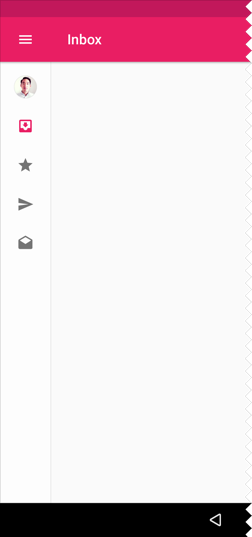
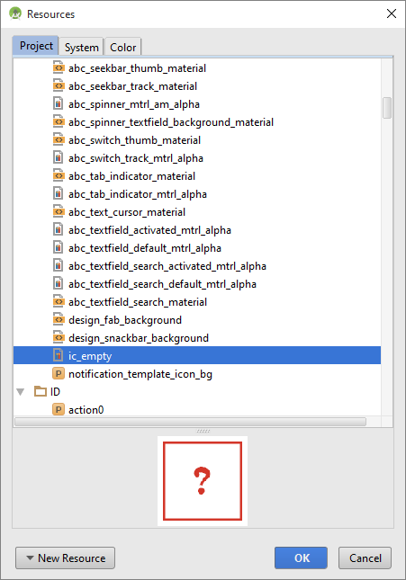
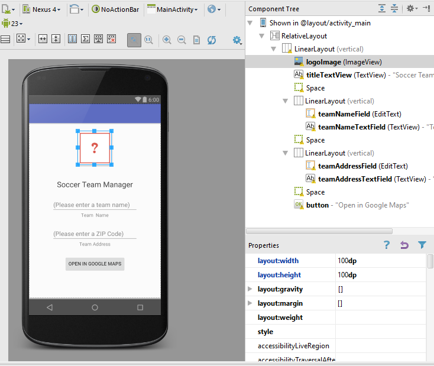
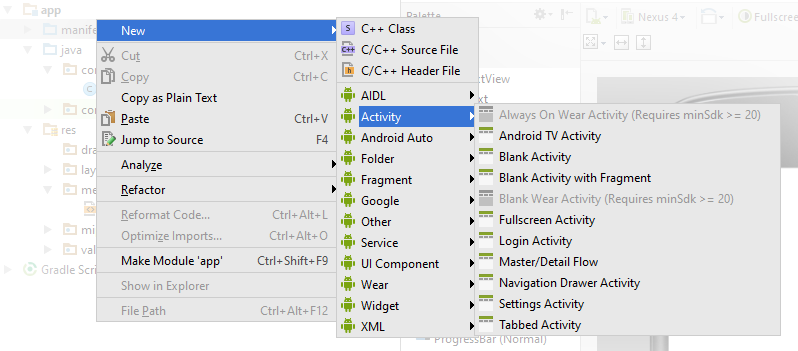
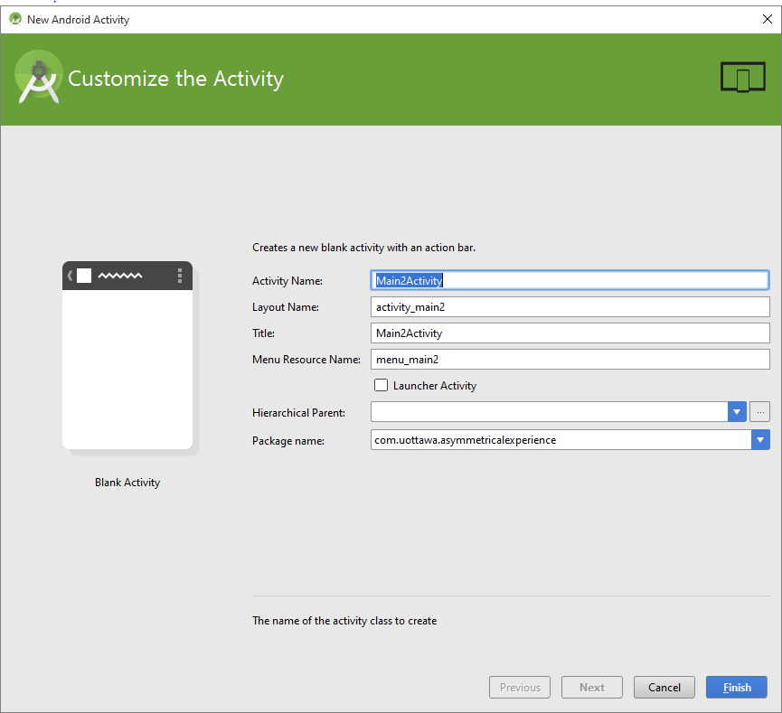
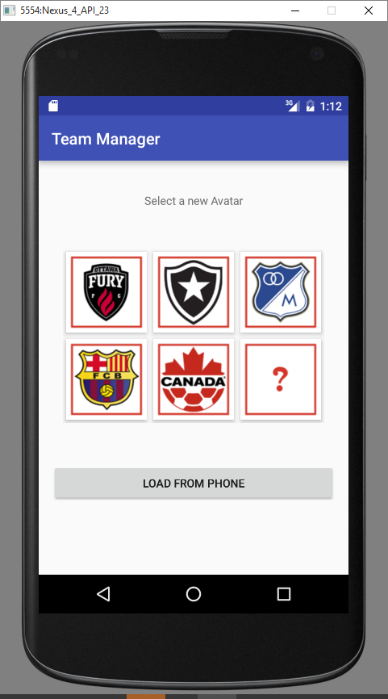

### Développement d'applications Android

Laboratoire Android 2 : Les menus, les interactions et les activités

<span style="color:gray"></span>

<span style="color:gray">SEG 2505 - Introduction au génie logiciel</span>

<span style="color:gray">Automne 2017</span>

<span style="color:gray">Présenté par : Cédric Clément</span>

---

### Plan

1. Éléments d'interfaces usagers
2. Les activités
3. Les intentions
4. Le transfert de données
5. Travail de laboratoire

<span style="font-size:0.6em;color:gray">Appuyez sur la clé <span style="color:#3884b9">**O**</span> pour voir un survole de la présentation.</span>

---

### Éléments d'interfaces usagers

+++

##### Menus et la barre d'action

- <span style="font-size:0.6em;color:gray">Android vous offre une variété d'éléments visuels</span>
    - <span style="font-size:0.6em;color:gray">options dans les <span style="color:#00aa60">menus</span></span>
    - <span style="font-size:0.6em;color:gray"><span style="color:#e8bf6a">barre</span> d'action</span>
    - <span style="font-size:0.6em;color:gray">menu contextuel ("long-click")</span>
    - <span style="font-size:0.6em;color:gray">"<span style="color:#3884b9">popup</span>"</span>
- <span style="font-size:0.6em;color:gray">définitions de ces éléments en <span style="color:#d0d0ff">XML</span></span>

Note:
- Menu "Popup" : les actions dans ces menus ne devraient pas avoir un impacte directe sur le contenu, mais plutôt pour les séries d'actions

+++

<span style="color:gray">La gestion de ces événements se fait avec des "<span style="color:#3884b9">Click Events</span>" comme <span style="color:white">`OnClick()`</span> ou avec un <span style="color:#c45331">Override</span> de <span style="color:white">`onOptionItemSelected()`</span>.</span>

+++

#### Les fragments

- <span style="font-size:0.6em;color:gray">représentente des <span style="color:#00aa60">portions</span> d'une interface</span>
- <span style="font-size:0.6em;color:gray">peuvent être <span style="color:#e8bf6a">combinés</span></span>
- <span style="font-size:0.6em;color:gray"><span style="color:#3884b9">modulaire</span></span>


Note:
- les Fragments sont utilisés pour représenter des portions d'une interface d'utilisateur
- plusieurs Fragments peuvent être combinés pour créer une interface
- les Fragments sont réutilisables et modulaires

+++

#### Tiroire de navigation

<span style="font-size:0.6em;color:gray">Panneau qui présente les <span style="color:#3884b9">fonctions de navigation</span> pour l'application.</span>

- <span style="font-size:0.6em;color:gray">Types:</span>
    1. <span style="font-size:0.6em;color:gray">**Permanent**: <span style="color:#a1617a">toujours présent</span></span>
    2. <span style="font-size:0.6em;color:gray">**Persistant**: ouvrir/fermer/basculer, <span style="color:#00aa60">déplace le contenu</span></span>
    3. <span style="font-size:0.6em;color:gray">**Temporaire**: ouvrir/fermer/basculer, <span style="color:#d0d0ff">masque le contenu</span></span>
    4. <span style="font-size:0.6em;color:gray">**Mini-Variable**: petit panneau avec des <span style="color:orange">icônes seulement</span>. Peut être utilisé dans l'état fermé.</span>

Note:
- C'est un panneau qui présente les fonctions de navigation pour l'application. Il y a 4 types:
1. Permanent: toujours présent
2. Persistant: ouvrir/fermer/basculer, déplace le contenu
3. Temporaire: ouvrir/fermer/basculer, masque le contenu
4. Mini-Variable: petit panneau avec des icônes seulement. Peut être utilisé dans l'état fermé.

+++



+++

#### Les dialogues

- <span style="font-size:0.6em;color:gray">invitent l'utilisateur à <span style="color:#e8bf6a">prendre une décision</span></span>
- <span style="font-size:0.6em;color:gray">types: `AlertDialog`, `DatePickerDialog`, `TimePickerDialog`, `Custom`</span>


Note:
- les dialogues invitent l'utilisateur à prendre/fournir une décision ou pour des informations supplémentaires avant que l'application peut continuer
- types de dialogues
- AlertDialog
- DatePickerDialog
- TimePickerDialog
- Custom Layout

+++

#### Les Toasts

- <span style="font-size:0.6em;color:gray">morceaux de texte qui fournissent des <span style="color:orange">informations simples</span></span>
- <span style="font-size:0.6em;color:gray">disparaissent <span style="color:#a1617a">automatiquement</span></span>


Note:
- des morceaux de texte qui fournissent des informations simples
- disparaissent automatiquement après un montant de temps
- vous pouvez manipuler le positionnement

+++

#### Paramètres <span style="font-size:0.6em;color:gray">(Settings)</span>

<span style="color:gray">Permettent aux utilisateurs de <span style="color:#00aa60">modifier le fonctionnement</span> et le comportement d'une application.</span>
<br><br>
<span style="color:gray">Aide avec la construction d'<span style="color:#d0d0ff">interface uniforme</span> dans les applications Android.</span>

Note:
- Permettent aux utilisateurs de modifier le fonctionnement et le comportement d'une application (e.g : comment souvent faire une requête à la DB)
- Permettent la construction d'interface uniforme dans les applications Android

+++


---

### Les activités

- <span class="txtGray" style="font-size:0.6em" >Les activités sont des <span class="txtGreen ">composantes d'application</span> qui permettent aux utilisateurs de faire une chose telle que d'entrer un numéro de téléphone, envoyer une photo, envoyer un message, visualiser une carte...</span>
- <span style="font-size:0.6em" class=" txtGray" style="font-size:0.6em">Une application a typiquement <span class="txtSmall txtOrange ">plusieurs activités</span>, une qui est l'activité principale (MainActivity)</span>
- <span style="font-size:0.6em" class=" txtGray " style="font-size:0.6em">Les activités individuelles ont leurs propres tâches. Ces activités sont <span class="txtSmall txtBlueL ">liées ensemble avec des Intents</span>.</span>
- <span style="font-size:0.6em" class=" txtGray " style="font-size:0.6em">Lorsqu'une activité débute, l'activité antérieure est arrêtée et <span class="txtSmall txtPurple ">préservée dans le Stack</span></span>
- <span style="font-size:0.6em" class=" txtGray " style="font-size:0.6em">Il n'y a <span class="txtSmall txtRed ">pas de `Main()`</span>. Les activités commencent à partir de leur méthode <span class="txtSmall txtLavender ">`OnCreate()`</span>.</span>


Note:
- <span style="font-size:0.6em" class=" txtGray ">Les activités sont des composantes d'application qui permettent aux utilisateurs de faire une chose telle que d'entrer un numéro de téléphone, envoyer une photo, envoyer un message, visualiser une carte...</span>
- <span style="font-size:0.6em" class=" txtGray ">Une application a typiquement plusieurs activités, une étant l'activité principale (MainActivity)</span>
- <span style="font-size:0.6em" class=" txtGray ">Les activités individuelles ont leurs propres tâches. Ces activités sont liées ensemble avec des Intents.</span>
- <span style="font-size:0.6em" class=" txtGray ">Lorsqu'une activité débute, l'activité antérieure est arrêtée et préservée dans le Stack</span>
- <span style="font-size:0.6em" class=" txtGray ">Il n'y a pas de Main(). Les activités commencent à partir de leur méthode OnCreate().</span>

+++

Commencer une nouvelle activité

- <span style="font-size:0.6em" class=" txtGray ">Les activités peuvent être appelées avec les fonctions suivantes:</span>
- <span style="font-size:0.6em" class=" txtGray ">startActivity(Intent i)</span>
- <span style="font-size:0.6em" class=" txtGray ">remarque: chaque activité à besoin d'un Intent</span>
- <span style="font-size:0.6em" class=" txtGray ">les Intents peuvent être des morceaux d'applications ou des applications entières</span>
- <span style="font-size:0.6em" class=" txtGray ">startActivityForResult(Intent i, RequestCode c)</span>


---

### Les intentions

- <span style="font-size:0.6em" class=" txtGray ">Ce sont des objets messagers conçus pour envoyer la requête d'actions à des composantes</span>
- <span style="font-size:0.6em" class=" txtGray ">Cas d'utilisation d'un Intent: commencer une activité ou un service, livrer un message global (broadcast)</span>
    - <span style="font-size:0.6em" class=" txtGray ">Types: implicite, explicite</span>

+++


+++

Les Intents contiennent...
- <span style="font-size:0.6em" class=" txtGray ">nom d'une composante</span>
- <span style="font-size:0.6em" class=" txtGray ">une action</span>
- <span style="font-size:0.6em" class=" txtGray ">des informations (data)</span>
- <span style="font-size:0.6em" class=" txtGray ">une catégorie</span>
- <span style="font-size:0.6em" class=" txtGray ">des surplus (Extra)</span>
- <span style="font-size:0.6em" class=" txtGray ">des drapeaux</span>

[Documentation sur les intentions](http://developer.android.com/guide/components/intents-filters.html)

---

### Travail de laboratoire
+++

Todo

<span style="font-size:0.6em">Vous devez créer un gestionnaire d'équipe sportive. Ce gestionnaire devra gérer les joueurs d'une équipe et plusieurs équipe.</span>

<span style="font-size:0.6em" class=" txtGray ">L'aplication doit:</span>

2. <span style="font-size:0.6em" class=" txtGray ">avoir plusieurs activités</span>
2. <span style="font-size:0.6em" class=" txtGray ">permettre l'utilisateur de créer/changer le nom d'un profile</span>
2. <span style="font-size:0.6em" class=" txtGray ">permettre l'utilisateur d'ajouter/changer l'image d'un profile</span>
2. <span style="font-size:0.6em" class=" txtGray ">permettre l'utilisateur d'ajouter/modifier une adresse un profile</span>
2. <span style="font-size:0.6em" class=" txtGray ">permettre l'utilisateur d'ouvrir une adresse dans une application de carte (eg. Google Maps)</span>
    
+++

Activitée principale : vue du profil

1. <span style="font-size:0.6em" class=" txtGray ">créez un nouveau projet avec une activité vide</span>
2. <span style="font-size:0.6em" class=" txtGray ">ajoutez un champ EditText pour le champ Personne/Équipe</span>
3. <span style="font-size:0.6em" class=" txtGray ">ajoutez un champ TextView pour accompagner le champ EditText</span>
4. <span style="font-size:0.6em" class=" txtGray ">définissez la valeur de la propriété "hint" du EditText à "Veuillez ajouter un nom"</span>
5. <span style="font-size:0.6em" class=" txtGray ">répétez ce processus pour le champ lieu (Location)</span>

<span style="font-size:0.6em">continuez sur la prochaine diapositive...</span>

+++

<span style="font-size:0.6em">...</span>

6. <span style="font-size:0.6em" class=" txtGray ">ajoutez une vue d'image ImageView pour représenter l'image de l'équipe</span>
7. <span style="font-size:0.6em" class=" txtGray ">l'image sera initialement invisible, car aucune image ne sera assignée au champ et la valeur de la propriété "size" ne sera pas définie</span>
8. <span style="font-size:0.6em" class=" txtGray ">changez les propriétés de "width" et "height" à "100dp". Ceci rendra la boîte à 'image visible.</span>
9. <span style="font-size:0.6em" class=" txtGray ">ajoutez un bouton qui servira à ouvrir la carte</span>
10. <span style="font-size:0.6em" class=" txtGray ">La valeur du OnClick sera OnOpenInGoogleMaps (tantôt)</span>


---

Changer les images

- <span style="font-size:0.6em" class=" txtGray ">pour des médias (image, son, etc.) à votre projet vous avez qu'à placer les fichiers dans le répertoire "drawable"</span>
- <span style="font-size:0.6em">`app > res > drawable`</span>
- <span style="font-size:0.6em" class=" txtGray ">right-click > "show in explorer"</span>
- <span style="font-size:0.6em" class=" txtGray ">changez l'image défaut</span>
- <span style="font-size:0.6em"> copy-paste: https://github.com/cedric-c/seg2505_2017/blob/laboratoire4/assets/images.zip</span>




+++




---

Intent explicite et activité externe

- <span style="font-size:0.6em" class=" txtGray ">ajoutez la prochaine méthode à votre activité principale (`MainActivity.java`)</span>
- <span style="font-size:0.6em" class=" txtGray ">changez la propriété `OnClick`</span>
- <span style="font-size:0.6em" class=" txtGray ">cette fonction fait une demande explicite au paquet de Google Maps</span>

<span style="font-size:0.6em" class=" txtGray ">Notez que vous devez avoir le cadriciel de Google (Google API) dans votre émulateur virtuel pour que ceci fonctionne</span>

```java
public void OnOpenInGoogleMaps (View view) {
    EditText teamAddres = (EditText) findViewById(R.id.teamAddressField);
    Uri gmmIntentUri = Uri.parse("http://maps.google.co.in/maps?q="+teamAddres.getText());
    Intent mapIntent = new Intent(Intent.ACTION_VIEW, gmmIntentUri);
    mapIntent.setPackage("com.google.android.apps.maps");
    startActivity(mapIntent);
}
```
@[2](Creating a return intent to pass to the Main Activity)
@[3](Créer un objet URI (URL) à partir de l'adresse)
@[4](Créer l'intention (Intent))
@[5](Déclarer l'intention comme explicite)
@[6](Commencer l'activité)


+++

Intent explicite et activité interne

- <span style="font-size:0.6em" class=" txtGray ">ajoutez la prochaine fonction à votre activité principale (MainActivity.java)</span>
- <span style="font-size:0.6em" class=" txtGray ">changez la propriété OnClick de votre ImageView</span>
- <span style="font-size:0.6em" class=" txtGray ">ceci va ouvrir une autre activité où nous allons choisir une nouvelle image pour l'équipe</span>

```java
public void OnSetAvatarButton(View view) {
    Intent intent = new Intent(getApplicationContext(), ProfileActivity.class);
    startActivityForResult (intent,0);
}
```
<!-- @[2](https://developer.android.com/reference/android/content/Intent.html) -->
<!-- @[3](https://developer.android.com/training/basics/intents/result.html) -->


+++

Le constructeur de l'objet Intent a deux paramètres

1. <span style="font-size:0.6em" class=" txtGray ">le contexte d'application (Application Context) : c'est d'où arrive l'application</span>*

2. <span style="font-size:0.6em" class=" txtGray ">classe d'intention : c'est la classe pour laquel l'intention fait demande</span>

+++

<center>*</center>

<span style="font-size:0.6em" class=" txtGray ">Lorsque vous créez une nouvelle activité, une hiérarchie est créée et la nouvelle activité a comme parent l'activité qui a fait appelle à sa création</span>
- <span style="font-size:0.6em" class=" txtGray ">vous passez <span style="color:white">`this`</span> comme contexte,</span>
- <span style="font-size:0.6em" class=" txtGray ">autrement, utilisez `getApplicationContext()` pour obtenir le contexte de l'application</span>


---

MÀJ (1)

- <span style="font-size:0.6em" class=" txtGray ">votre application devra être similaire à ce que vous voyez ici</span>
- <span style="font-size:0.6em" class=" txtGray ">ajoutez à la propriété `OnClick` une valeur de `OnOpenInGoogleMaps`</span>
- <span style="font-size:0.6em" class=" txtGray ">ajoutez à la propriété `OnClick` du ViewImage le nom d'une fonction sur une autre diapositive</span>
    - <span style="font-size:0.6em" class=" txtGray ">cette fonction va ouvrir la sélection de logo d'équipe</span>


+++

Créer une nouvelle activité

<span style="font-size:0.6em"><span style="color:white">`right-click`</span> et sélectionnez <span style="color:white">`New > Activity > Blank Activity`</span></span>




+++

Créer une nouvelle activité (cont.)

- <span style="font-size:0.6em" class=" txtGray ">ajoutez les informations de votre choix et appuyez sur "Finish"</span>
- <span style="font-size:0.6em" class=" txtGray ">lorsque vous créez une activité, Android Studio crée un nouveau fichier Java ainsi qu'un fichier XML pour l'interface d'utilisateur</span>

+++

Parent hiérarchique

<span style="font-size:0.6em"><span class="txtSmall txtGray ">Si votre application implémente la fonctionnalité "UP", vous pouvez déclarer une autre activité comme le parent d'une autre</span></span>


+++

Exemple de fonctionnalité UP




---

Deuxième activité

- <span style="font-size:0.6em" class=" txtGray ">créez une deuxième activité qui est l'enfant de votre activité principale (MainActivity). Ceci se fait dans la boite de création.</span>
- <span style="font-size:0.6em" class=" txtGray ">supprimez ce qui se trouve sur l'écran et ajoutez un VerticalLayout</span>
- <span style="font-size:0.6em" class=" txtGray ">ajoutez un GridLayout au VerticalLayout et créez 6 nouveaux ImageViews à l'intérieur du VerticalLayout</span>
- <span style="font-size:0.6em" class=" txtGray ">ajoutez un bouton au VerticalLayout sous le GridLayout</span>

+++

Comment puis-je retourner à l'activité principale ?
- <span style="font-size:0.6em" class=" txtGray ">Les activités sont <span class="txtSmall txtGreen">structurées en pile</span>. Une activité qui termine est "pop-é" de la pile et l'activité principale est rappelée. Notez que les champs locaux (dans les activités parentes) qui contiennent des informations ne les perdent pas lorsqu'une activité enfant est "pop-é".</span>
- <span style="font-size:0.6em" class=" txtGray ">Lorsqu'on pop une activité, on tue l'instance</span>
- <span style="font-size:0.6em" class=" txtGray ">Vous n'avez pas besoin de créer de bouton retour / “back”, Android fait ceci pour vous</span>

+++

Retour à l'activité principale

- <span style="font-size:0.6em" class=" txtGray ">ajoutez la prochaine fonction à votre deuxième fichier d'activité</span>
- <span style="font-size:0.6em" class=" txtGray ">ceci devrait être la méthode OnClick sur vos images</span>
- <span style="font-size:0.6em" class=" txtGray ">le code envoie les ID des images qui ont été appuyées</span>

```java
public void setTeamIcon(View view){
    Intent returnIntent = new Intent();
    ImageView selectedImage = (ImageView) view;
    returnIntent.putExtra("imageID", selectedImage.getId());
    setResult(RESULT_OK, returnIntent);
    finish();
}

```
@[2](Créer l'intention pour retourner les informations à `MainActivity`)
@[3](Obtenir l'information de l'image sélectionnée)
@[4-5](Ajouter les informations à l'intention créée sur la ligne 2)
@[6](Envoyer l'intention)


---

MÀJ (2)

- <span style="font-size:0.6em" class=" txtGray ">votre application devra être similaire à ce que vous voyez ici</span>
- <span style="font-size:0.6em" class=" txtGray ">ajoutez à la propriété OnClick de chaque icône la valeur de "SetTeamIconOnClick"</span>
    - <span style="font-size:0.6em" class=" txtGray ">chaque image peut être liée à la fonction sur la prochaine diapositive</span>
    
+++




+++

Gérer les résultats

- <span style="font-size:0.6em" class=" txtGray ">Ajoutez cette méthode dans votre activité principale `MainActivity`. Cette méthode manipule les informations qui lui sont retournées dans le "Return Intent".</span>
- <span style="font-size:0.6em" class=" txtGray ">Les informations passées dans le "Return Intent" sont interprétées et utilisées pour choisir la nouvelle image.</span>
- <span style="font-size:0.6em" class=" txtGray ">Les noms des photos devraient être différents</span>

+++

```java
@Override
protected void onActivityResult(int requestCode, int resultCode, Intent data) {
    if (resultCode == RESULT_CANCELED) return;
    ImageView avatarImage = (ImageView) findViewById(R.id.avatarImage);
    
    String drawableName = "ic_logo_00"; //4
    switch (data.getIntExtra("imageID",R.id.teamid00)) {//Figuring out the correct image
        case R.id.teamid00:
            drawableName = "ic_logo_00";
            break;
        case R.id.teamid01:
            drawableName = "ic_logo_01";
            break;
        case R.id.teamid02:
            drawableName = "ic_logo_02";
            break;
        case R.id.teamid03:
            drawableName = "ic_logo_03";
            break;
        case R.id.teamid04:
            drawableName = "ic_logo_04";
            break;
        case R.id.teamid05:
            drawableName = "ic_logo_05";
            break;
        default:
            drawableName = "ic_logo_00";
            break;
    } //27
    int resID = getResources().getIdentifier(drawableName, "drawable",  getPackageName());
    avatarImage.setImageResource(resID);
}

```
@[2](Obtenir l'image que nous allons montrer à l'utilisateur)
@[4-27](Obtenir le nom de l'image)
@[28-29]()

---

MÀJ (3)

- <span style="font-size:0.6em" class=" txtGray ">Votre application devrait:</span>
    - <span style="font-size:0.6em" class=" txtGray ">montrer et pouvoir mettre à jour les noms d'équipe ainsi que les adresses</span>
    - <span style="font-size:0.6em" class=" txtGray ">monter les adresses sur Google Maps</span>
    - <span style="font-size:0.6em" class=" txtGray ">pouvoir mettre à jour les images d'équipe à partir d'une liste prédéfinie d'images</span>
- <span style="font-size:0.6em" class=" txtGray ">Votre application ne devrait pas encore:</span>
    - <span style="font-size:0.6em" class=" txtGray ">charger les images à partir d'images existantes sur le système (optionnel)</span>

+++

Notez que charger les images à partir d'images existantes sur le système porte quelques contraintes:
1. <span style="font-size:0.6em" class=" txtGray ">des permissions sont requises</span>
2. <span style="font-size:0.6em" class=" txtGray ">des fichiers "manifest" doivent être gérés</span>

---

Intentions implicites (Implicit Intents) [1]

- <span style="font-size:0.6em" class=" txtGray ">fonctionnalité de la caméra avec intention implicite:</span>

`Intent i = new Intent(MediaStore.ACTION_IMAGE_CAPTURE);`

- <span style="font-size:0.6em" class=" txtGray ">peut ajouter des méta-informations (“Metadata”)</span>
- <span style="font-size:0.6em" class=" txtGray ">`onActivityResult` reçoit un hyperlien à une image et décodera l'image</span>

+++

```java
String dateExtension = new Date().getTime() + ".png";
File file = new File(Environment.getExternalStorageDirectory() + "/DCIM", "image" + dateExtension);
Uri imgUri = Uri.formFile(file);
String imgPath = file.getAbsolutePath();
final Intent intent = new Intent(MediaStore.ACTION_IMAGE_CAPTURE);
intent.putExtra(MediaStore.EXTRA_OUTPUT, setImageUri());
startActivityForResult(intent, CAPTURE_IMAGE);

// ... votre code ...

@Override
protected void onActivityResult(int requestCode, int resultCode, Intent data){
    if(resultCode != Activity.RESULT_CANCELLED){
        if(requestCode == CAPTURE_IMAGE){
            ImageView imageView = (ImageView) findViewById(R.id.imgView);
            imageView.setImageBitmap(BitmapFactory.decodeFile(imgPath));
        }
    }
}
```
<!-- @[2](Obtenir l'image que nous allons montrer à l'utilisateur) -->
<!-- @[4-27](Obtenir le nom de l'image) -->
<!-- @[28-29]() -->


---

Intentions implicites (Implicit Intents) [2]


- <span style="font-size:0.6em" class=" txtGray ">fonctionnalité pour sauvegarder des informations</span>

`Intent i = new Intent(Intent.ACTION_PICK);`

- <span style="font-size:0.6em" class=" txtGray ">peut ajouter des méta-informations (Metadata)</span>
- <span style="font-size:0.6em" class=" txtGray ">`onActivityResult` reçoit un hyperlien à un fichier et décodera le fichier</span>

+++

```java
Intent i = new Intent(Intent.ACTION_PICK,android.provider.MediaStore.Images.Media.EXTERNAL_CONTENT_URI); startActivityForResult(i, RESULT_LOAD_IMAGE); 

// < ... votre code ... > 

@Override
protected void onActivityResult(int requestCode, int resultCode, Intent data) {
    super.onActivityResult(requestCode, resultCode, data);
    if (requestCode == RESULT_LOAD_IMAGE && resultCode == RESULT_OK && null != data) {
        Uri selectedImage = data.getData();
        String[] filePathColumn = { MediaStore.Images.Media.DATA };
        Cursor cursor = getContentResolver().query(selectedImage,filePathColumn, null, null, null);
        cursor.moveToFirst();
        int columnIndex = cursor.getColumnIndex(filePathColumn[0]);
        String picturePath = cursor.getString(columnIndex);
        cursor.close();
        ImageView imageView = (ImageView) findViewById(R.id.imgView);
        imageView.setImageBitmap(BitmapFactory.decodeFile(picturePath));
    }
}
```
<!-- @[2](Obtenir l'image que nous allons montrer à l'utilisateur) -->
<!-- @[4-27](Obtenir le nom de l'image) -->
<!-- @[28-29]() -->


---

Résumé

- activité
- intentions
    - explicite: nom de la classe (launch Google Maps)
    - implicite: type d'action / data (view Map applications)

---

- [Formation Android](https://developer.android.com/training/index.html)
- [Documentation Android](https://developer.android.com/index.html)
