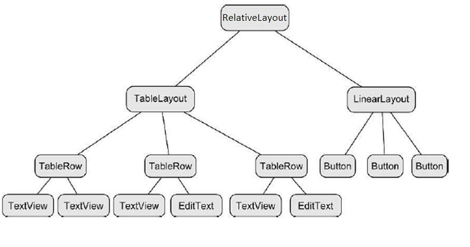
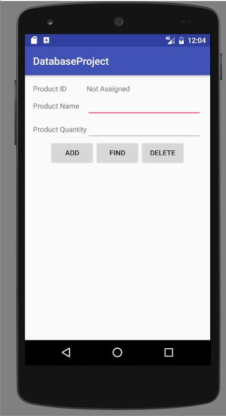
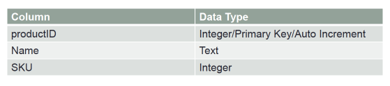

### Développement d'applications Android

Laboratoire Android 3 : Base de données (DB) locale sur Android

<span style="color:gray"></span>

<span style="color:gray">SEG 2505 - Introduction au génie logiciel</span>

<span style="color:gray">Automne 2017</span>

<!-- <span style="color:gray">Présenté par : Cédric Clément</span> -->

---

### Agenda
1. <span style="font-size:0.6em;color:gray">Survole de SQLite sur Android</span>
2. <span style="font-size:0.6em;color:gray">La base des tables, schémas, clés primaires</span>
3. <span style="font-size:0.6em;color:gray">Structured Query Language (SQL)</span>
4. <span style="font-size:0.6em;color:gray">Exemple de SQLite simple</span>
5. <span style="font-size:0.6em;color:gray">Travail de laboratoire</span>

---

#### Qu'est-ce SQLite?

- <span style="font-size:0.6em;color:gray">Les applications mobiles ont besoin de garder des <span style="color:#3884b9">informations locales</span></span>
- <span style="font-size:0.6em;color:gray">La base de données se retrouve dans presque <span style="color:#a1617a">chaque application</span></span>
    - <span style="font-size:0.6em;color:gray">les applications qui <span style="color:#00aa60">manipulent les données</span></span>
    - <span style="font-size:0.6em;color:gray">les applications qui font que sauver des <span style="color:#c45331">informations simples</span> comme les points pour un match de soccer</span>
- <span style="font-size:0.6em;color:gray">Pouvoir capter des informations dans une base de données est du plus important puisque l'environnement Android peut à n'importe quel instant supprimer les informations en mémoire pour se servir de ces ressources.</span>

+++

#### Qu'est-ce SQLite?

- <span style="font-size:0.6em;color:gray">SQLite est une base de données <span style="color:orange">intégrée</span></span> 
- <span style="font-size:0.6em;color:gray">La plupart des bases de données (Oracle, MySQL) sont des <span style="color:#a1617a">processus</span> qui fonctionnent de manière <span style="color:#a1617a">indépendante</span></span>
- <span style="font-size:0.6em;color:gray">SQLite est dit "<span style="color:#00aa60">intégré</span>" car c'est qu'une librairie qui <span style="color:#00aa60">fait partie d'une application</span></span>
    - <span style="font-size:0.6em;color:gray">il n'y a donc <span style="color:#BE4C51">aucun processus dédié</span> qui soutient l'exécution de la base de données</span>
- <span style="font-size:0.6em;color:gray">Les opérations effectuées dans la base de données se font à l'<span style="color:#3884b9">intérieur</span> de la librairie SQLite</span>

---

### Comprendre les tables

- <span style="font-size:0.6em;color:gray">Une structure simple dans la DB</span>
- <span style="font-size:0.6em;color:gray">Chaque DB peut contenir <span style="color:#a1617a">plusieurs tables</span> et chaque table est conçue pour contenir un type d'information spécifique</span>
- <span style="font-size:0.6em;color:gray">Exemple</span>
    - <span style="font-size:0.6em;color:gray">Une DB peut contenir une table "client" qui contient le nom, l'adresse, le numéro téléphonique de chaque client pour une organisation</span>
    - <span style="font-size:0.6em;color:gray">La même DB pourrait aussi contenir une table "produits" qui contient des entrées de produits (identifiant du produit, description) qu'offre une organisation.</span>

+++

### Comprendre les tables

- <span style="font-size:0.6em;color:gray">Chaque table dans une DB a un nom unique</span>


---

### Le schéma

- <span style="font-size:0.6em;color:gray">Le schéma définit les <span style="color:#d0d0ff">caractéristiques</span> des données sauvegardées dans la table d'une DB</span>
- <span style="font-size:0.6em;color:gray">Le schéma pour table de client pourrait définir que</span>
    - <span style="font-size:0.6em;color:gray">un client <span style="color:#c45331">n'aura pas</span> de nom de plus de 20 caractères de longueur</span>
    - <span style="font-size:0.6em;color:gray">l'entrée téléphonique d'un client <span style="color:#00aa60">aura que</span> des entrées d'un certain format</span>
- <span style="font-size:0.6em;color:gray">Les schémas sont aussi utilisés pour <span style="color:#a1617a">définir</span> la structure entière d'une DB et les relations entre les tables qu'elle contient</span>

---

### Colonnes et types de donnée

- <span style="font-size:0.6em;color:gray">Chaque colonne représente un champ dans une DB (nom, téléphone, courriel)</span>
- <span style="font-size:0.6em;color:gray">Chaque colonne doit contenir un type spécifié de donnée</span>

---

### Clés primaires

- <span style="font-size:0.6em;color:gray">Chaque DB contient une ou plusieurs colonnes utilisées pour identifier chaque rangée d'une manière unique</span>
- <span style="font-size:0.6em;color:gray">C'est ce qu'on nomme la clé primaire (primary key)</span>
- <span style="font-size:0.6em;color:gray">Exemple: numéro bancaire, NAS</span>
- <span style="font-size:0.6em;color:gray">C'est ce qui permet à un système de DB d'identifier de manière unique chaque entrée dans la DB sans clé primaire, il ne serait pas possible de supprimer des entrées spécifiques</span>

---

### Structured Query Language (SQL)

- <span style="font-size:0.6em;color:gray">Les données sont manipulées avec un langage appelé Structured Query Language</span>
- <span style="font-size:0.6em;color:gray">C'est le standard </span>
- <span style="font-size:0.6em;color:gray">C'est simple et conçu pour lire et écrire à une DB</span>
    - <span style="font-size:0.6em;color:gray">Peu de mots clés</span>
    - <span style="font-size:0.6em;color:gray">Différentes implémentations de SQL ont souvent une syntaxe identique</span>
    
+++
    
#### Commande utile : `Create Table`

```
CREATE TABLE table_name(
    column1 datatype PRIMARY KEY
    column2 datatype,
    column3 datatype,
    ....
    columnN datatype,
);
```

+++

#### Commande utile : `Drop Table` pour supprimer (table)

- `DROP TABLE table_name`
- `DROP TABLE IF EXISTS table_name`

+++

#### Commande utile : `Insert into Table` pour ajouter (élément)

`INSERT INTO table_name VALUES (value1, value2, value3, ...);`

+++

#### Commande utile : `Delete from Table` pour supprimer (élément)

`DELETE FROM table_name WHERE some_column=some_value;`

+++

#### Commande utile : Retrait
`SELECT column_name, column_name FROM table_name WHERE column_name=value;`

---

## Exemple simple

+++

### Interface d'utilisateur



+++



+++

### Table de produits



---

## Livrable du laboratoire

---

### Importez le projet

[Database Project](https://github.com/mgarzon/DatabaseProject)

<span style="font-size:0.6em;color:gray">`Import` dans Android Studio: `File > New > Import Project`</span>

<span style="font-size:0.6em;color:gray">Vous devez implémenter pour ajouter, lire, et supprimer de la base de donnée (`add`, `read`, et `delete`).</span>

---

### Première étape

- <span style="font-size:0.6em;color:gray">Créez une classe qui **extends** `SQLiteOpenHelper` qui servira à exécuter les opérations insert, read et delete de SQLite.</span>

```java
import android.database.sqlite.SQLiteDatabase;
import android.database.sqlite.SQLiteOpenHelper;
import android.content.Context;
import android.content.ContentValues;
import android.database.Cursor;

public class MyDBHandler extends SQLiteOpenHelper{
    
    private static final int DATABASE_VERSION = 1;
    private static final String DATABASE_NAME = "productDB.db";
    public static final String TABLE_PRODUCTS = "products";
    public static final String COLUMN_ID = "_id";
    public static final String COLUMN_PRODUCTNAME = "productname";
    public static final String COLUMN_SKU = "SKU";

    // ...
}
```
@[1-5](à importer...)
@[8-14](Définition du schéma)

+++

<span style="font-size:0.6em;color:gray">Note: le constructeur de `MyDBHandler` doit appeler le constructeur de sa classe parent, soit</span>

```java
public MyDBHandler(Context context){
    super(context, DATABASE_NAME, null, DATABASE_VERSION);
}
```

+++

#### Créer la table

<span style="font-size:0.6em;color:gray">Vous devez faire un override de la méthode `onCreate()`</span>

```
@Override
public void onCreate(SQLiteDatabase db){
    
    String CREATE_PRODUCTS_TABLE = "CREATE TABLE" +
        TABLE_PRODUCTS + "("
        + COLUMN_ID + " INTEGER PRIMARY KEY," +
        COLUMN_PRODUCTNAME +
        " TEXT," + COLUMN_SKU + " INTEGER" + ")";
    
    db.execSQL(CREATE_PRODUCTS_TABLE);
}
```

+++

#### Mise à jour 

<span style="font-size:0.6em;color:gray">Pour remplacer des anciennes tables par des nouvelles:</span>

```
@Override
public void onUpgrade(SQLiteDatabase db, int oldVersion, int newVersion) {
    db.execSQL("DROP TABLE IF EXISTS " + TABLE_PRODUCTS);
    onCreate(db);
}
```

---

### Opérations

+++

#### Insertion

```java
public void addProduct(Product product){
    SQLiteDatabase db = this.getWriteableDatabase();
    
    ContentValues values = new ContentValues();
    values.put(COLUMN_PRODUCTNAME, product.getProductName());
    values.put(COLUMN_SKU, product.getSku());
    
    db.insert(TABLE_PRODUCTS, null, values);
    db.close();
}
```
@[1](Créez une méthode pour faire des ajouts)
@[2](Obtenez une instance d'une DB)
@[4-6](L'ajout des `key:value` dans l'objet `values`)
@[8](Insertion dans la DB)
@[9](Fermer la connection à la DB)

+++

#### Lecture

```java
public Product findProduct(String productName){
    SQLiteDatabase db = this.getReadableDatabase();
    
    String query = "Select * FROM " 
        + TABLE_PRODUCTS
        + " WHERE "
        + COLUMN_PRODUCTNAME
        + " = \""
        + productName
        + "\""
    ;
    
    Cursor cursor = db.rawQuery(query, null);
    Product product = new Product();
    
    if(cursor.moveToFirst()){
        product.setID(Integer.parseInt(cursor.getString(0)));
        product.setProductName(cursor.getString(1));
        product.setSku(Integer.parseInt(cursor.getString(2)));
        cursor.close()
    } else {
        product = null;
    }
    db.close();
    return product;
}
```
@[1](Créez une méthode pour faire des lectures)
@[2](Obtenez une instance d'une DB)
@[4-11](Créer votre query)
@[13](Exécuter votre query)
@[14-23](Créer l'objet **product**)
@[24](Fermer la connection à la DB)

+++

#### Supprimer

```java
public boolean deleteProduct(String productName){
    SQLiteDatabase db = this.getWriteableDatabase();
    boolean result = false;
    String query = "SELECT * FROM "
        + TABLE_PRODUCTS
        + " WHERE "
        + COLUMN_PRODUCTNAME
        + " = \""
        + productName
        + "\""
    ;
    Cursor cursor = db.rawQuery(query, null);
    
    if(cursor.moveToFirst()){
        String idStr = cursor.getString(0);
        db.delete(TABLE_PRODUCTS, COLUMN_ID + " = " + idStr, null);
        cursor.close();
        result = true;
    }
    db.close();
    return result;
}
```
@[1](Créez une méthode pour supprimer)
@[2](Obtenez une instance d'une DB)
@[4-11](Créer votre query)
@[12](Exécuter votre query)
@[14-19](Si l'objet existe, supprimer)
@[20](Fermer la connection à la DB)

---

### Dernière étape

```java
class ... {
    public static void main(String[] args) {
        
        MyDBHandler dbHandler = new MyDBHandler(this);
        
        // ...
        
        dbHandler.addProduct(product);
        
        // ...
        
        Product product = dbHandler.findProduct(productBox.getText().toString());
        
        // ...
        
        boolean result = dbHandler.deleteProduct(productBox.getText().toString());
    }
}
```