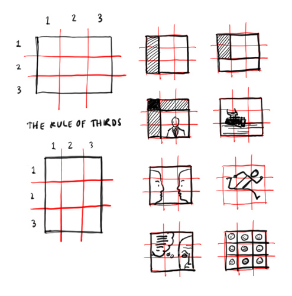
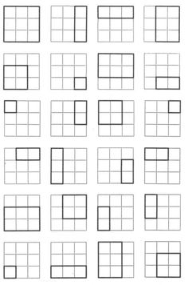
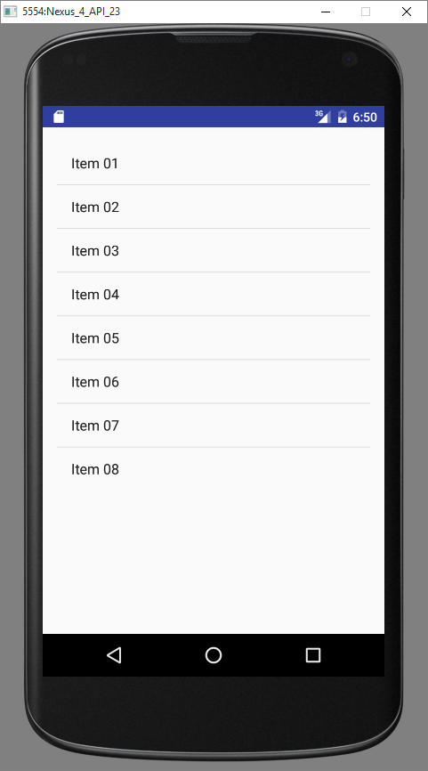
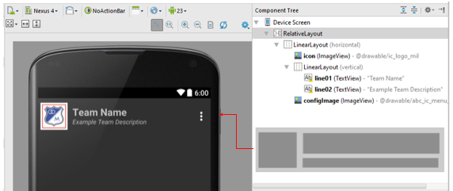
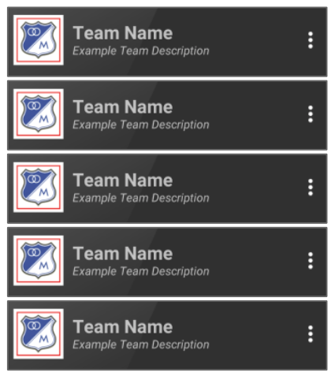
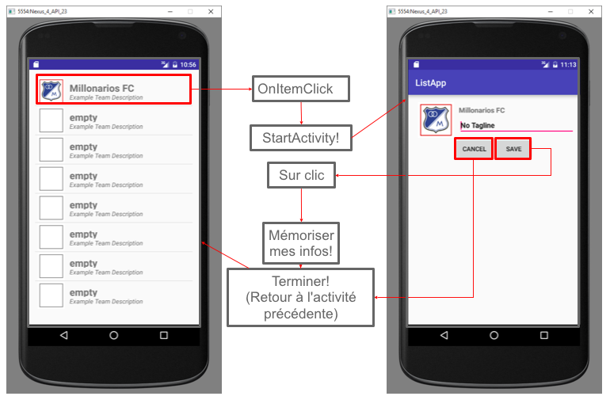
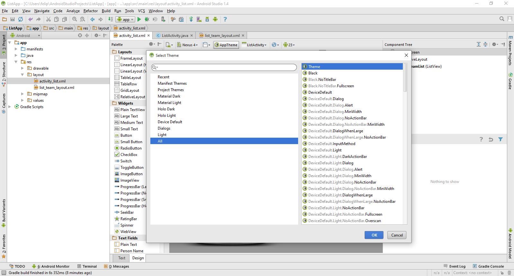
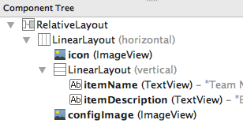
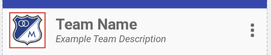

### Développement d'applications Android

Laboratoire Android 4 : Concepts UI supplémentaires et stockage

<span style="color:gray">SEG 2505 - Introduction au génie logiciel</span>

<span style="color:gray">Automne 2017</span>

<span style="color:gray">Présenté par : Cédric Clément</span>

---

### Agenda

1. <span style="font-size:0.6em;color:gray">Conception de l'interface utilisateur</span>
2. <span class="txtSmall txtGray" style="font-size:0.6em;">Remarques sur la gestion de mémoire</span>
3. <span class="txtSmall txtGray "  style="font-size:0.6em;">Remarques supplémentaires et informations utiles</span>
4. <span class="txtSmall txtGray "  style="font-size:0.6em;">Travail de laboratoire</span>

---

### Résumé

- <span class="txtSmall txtGray "  style="font-size:0.6em;">Dans les laboratoires précédents, vous avez appris que vous pouvez mettre à jour les composants existants dans une mise en page.</span>
- <span class="txtSmall txtGray "  style="font-size:0.6em;">Aujourd'hui, nous allons voir comment créer des mises en page plus dynamiques et avec plus d’adaptabilité.</span>
- <span class="txtSmall txtGray "  style="font-size:0.6em;">Si vous avez manqué les séances de laboratoire précédentes, consultez le matériel précédent avant de poursuivre.</span>

---

### UI / UX : Principes de base

- <span class="txtSmall txtGray "  style="font-size:0.6em;">La conception d'interface utilisateur est le domaine responsable de:</span>
- <span class="txtSmall txtGray "  style="font-size:0.6em;">Interfaces utilisateur (UI)</span>
- <span class="txtSmall txtGray "  style="font-size:0.6em;">Expérience utilisateur (UX)</span>

<span class="txtSmall txtGray "  style="font-size:0.6em;">Les interfaces tactiles mobiles s'appuient sur une bonne conception d'interface: </span>

- <span class="txtSmall txtGray "  style="font-size:0.6em;">Outils d'interaction limitée (pas de souris, pas de clavier)</span>
- <span class="txtSmall txtGray "  style="font-size:0.6em;">Occlusion d'IU (Mains et doigts cachent derrière eux des informations)</span>
- <span class="txtSmall txtGray "  style="font-size:0.6em;">Espace limité (petits écrans)</span>

+++

### Simplicité

- <span class="txtSmall txtGray "  style="font-size:0.6em;">L'âge de conception matériel (design plat et en couches, feuilles de papier empilées)</span>
- <span class="txtSmall txtGray "  style="font-size:0.6em;">Évitez d'encombrer votre écran avec l'information (utilisez des icônes)</span>
- <span class="txtSmall txtGray "  style="font-size:0.6em;">Uniformité et cohérence</span>
- <span class="txtSmall txtGray "  style="font-size:0.6em;">Less is more</span>

+++

### Hiérarchie

- <span class="txtSmall txtGray "  style="font-size:0.6em;">Le contenu doit être placé sur l'écran en fonction de leur importance.</span>
- <span class="txtSmall txtGray "  style="font-size:0.6em;">Les humains "scan" de gauche à droite et de haut en bas</span>
- <span class="txtSmall txtGray "  style="font-size:0.6em;">Bars hauts, menus et titres ont un emplacement prédéfini.</span>
- <span class="txtSmall txtGray "  style="font-size:0.6em;">Les utilisateurs ont des attentes envers l'emplacement des composantes, respectez les lignes directrices!</span>


+++

#### Rule of Thirds



+++



+++

### Composition

- <span class="txtSmall txtGray "  style="font-size:0.6em;">Ajoutez des marges à votre application.</span>
- <span class="txtSmall txtGray "  style="font-size:0.6em;">Ne jamais toucher les frontières de l'écran</span>
- <span class="txtSmall txtGray "  style="font-size:0.6em;">Les contextes doivent être séparés.</span>

<span class="txtSmall txtGray "  style="font-size:0.6em;">densité indépendante pour les pixels (1 pixel à une densité de 160) dp = (Largeur en pixels * 160) / densité de l'écran</span>


+++

### Dynamisme

- <span class="txtSmall txtGray "  style="font-size:0.6em;">La réactivité est primordiale</span>


---

### Composantes

+++

### `ListView`

<span class="txtSmall txtGray "  style="font-size:0.6em;">Un `ListView` est une vue d'ensemble qui présente une liste d'objet "scrollable".</span>

<span class="txtSmall txtGray "  style="font-size:0.6em;">Les objets s'ajoutent à une liste avec l'aide d'un adaptateur.</span>

+++ 

### `GridView`

<span class="txtSmall txtGray "  style="font-size:0.6em;">Nous avons utilisé cette vue dans des laboratoires précédents. Par contre, elle recevait ses entrées de manière statique.</span>

+++

### Pour votre projet...

<span class="txtSmall txtGray "  style="font-size:0.6em;">Vous devez créer et gérer une liste d'objet. Ces objets seront mis à jour de manière dynamique ce qui signifie que votre liste aura besoin d'être mise à jour de manière dynamique.</span>

+++

### Adaptateur

- <span class="txtSmall txtGray "  style="font-size:0.6em;">L'adaptateur est le <span style="color:#c45331">lien entre les vues</span> d'adaptateur et ce qu'ils affichent.</span>
- <span class="txtSmall txtGray "  style="font-size:0.6em;">`ListView` et `GridView` étendent `AdapterView`</span>
- <span class="txtSmall txtGray "  style="font-size:0.6em;">Un adaptateur reçoit un <span style="color:#00aa60">`context`</span> et un <span style="color:#d0d0ff">`ressourceID`</span>.</span>
- <span class="txtSmall txtGray "  style="font-size:0.6em;">Vous pouvez déclarer l'adaptateur que vous voulez utiliser pour un `ListView` en appelant sa méthode <span style="color:#a1617a">`setAdapter`</span>.</span>

---

### `ListView` simple

- <span class="txtSmall txtGray "  style="font-size:0.6em;">peut être créé avec un tableau de chaînes et l'adaptateur `ArrayAdapter`</span>
- <span class="txtSmall txtGray "  style="font-size:0.6em;">mise en page préconstruite : <span style="color:#d0d0ff">`android.R.layout.simple_list_item_1`</span></span>
- <span class="txtSmall txtGray "  style="font-size:0.6em;">modifiez la méthode <span style="color:#b4c973">`onItemClick`</span> pour changer la fonctionnalité de votre application.</span>

+++



+++

### `onCreate` 

<span class="txtSmall txtGray "  style="font-size:0.6em;">Extrait de la méthode `onCreate` dans l'activité.</span>

```java
// Get ListView object from xml layout
listView = (ListView) findViewById(R.id.list);
//Defining Array values to show in ListView
String[] values = new String[] {
        "Item 01","Item 02","Item 03","Item 04","Item 05","Item 06","Item 07","Item 08"
};
//Converting Array to ArrayList
final ArrayList<String> list = new ArrayList<String>();
for (int i = 0; i < values.length; ++i) {
    list.add(values[i]);
}
//Create an ArrayAdapter and Set it on the ListView
ArrayAdapter adapter = new ArrayAdapter(this, android.R.layout.simple_list_item_1, list);
listView.setAdapter(adapter);
listView.setOnItemClickListener(new AdapterView.OnItemClickListener() {
    @Override
    public void onItemClick(AdapterView<?> parent, final View view, int position, long id) {
        final String item = (String) parent.getItemAtPosition(position);
        //Do something with the string that you just got!
    }
});
```

---

### Contenu dynamique

<span class="txtSmall txtGray "  style="font-size:0.6em;">Les listes...</span>
- <span class="txtSmall txtGray "  style="font-size:0.6em;">ne sont <span style="color:#BE4C51">pas limitées</span> aux types primitifs.</span>
- <span class="txtSmall txtGray "  style="font-size:0.6em;"><span style="color:#00aa60">peuvent contenir des objets</span>, images, etc.</span>

<span class="txtSmall txtGray "  style="font-size:0.6em;">Les "templates" pour ces listes sont des fichier layouts XML.</span>

+++

### Disposition (Layout)

- <span class="txtSmall txtGray "  style="font-size:0.6em;">Ceci est un <span style="color:#e8bf6a">modèle de base</span> pour l'unité d'une liste, représenté par un fichier XML.</span>
- <span class="txtSmall txtGray "  style="font-size:0.6em;">Définit la <span style="color:#a1617a">structure</span> des informations présentées dans chaque élément affiché dans une liste.</span>

+++



+++

### Comportement d'une liste

<span class="txtSmall txtGray "  style="font-size:0.6em;">Les éléments apparaissent de manière séquentielle.</span>

<span class="txtSmall txtGray "  style="font-size:0.6em;">Si les éléments prennent plus d'espace que disponible, une barre (trois points) sera ajouté à la droite de l'objet dans la liste.</span>




<!-- 18 -->

+++

### Adaptateur personnalisé

- <span class="txtSmall txtGray "  style="font-size:0.6em;">Pour créer une mise en page personnalisée, <span style="color:#c45331">vous devez créer un `CustomAdapter`</span> <span style="color:#00aa60">et</span> <span style="color:#a1617a">implémenter les méthodes requises</span>.</span>
- <span class="txtSmall txtGray "  style="font-size:0.6em;">Votre `CustomAdapter` devrait étendre un des adaptateurs existants. N'oubliez pas la méthode `getView`.</span>
- <span class="txtSmall txtGray "  style="font-size:0.6em;">Dans votre méthode <span style="color:#d0d0ff">`getView`</span>, vous devez avoir un <span style="color:#a1617a">`LayoutInflater`</span> (pour élargir les éléments de la liste).</span>

<!-- 19 -->

+++

### Extrait `onCreate`

```java
@Override
protected void onCreate(Bundle savedInstanceState) {
    super.onCreate(savedInstanceState);
    setContentView(R.layout.activity_list);
    ListView listView = (ListView) findViewById(R.id.list);
    String[] values = new String[]{
            "Millonarios FC", "empty", "empty", "empty", "empty", "empty", "empty", "empty"
    };
    TeamArrayAdapter adapter = new TeamArrayAdapter(this, values);
    listView.setAdapter(adapter);
    listView.setOnItemClickListener(new AdapterView.OnItemClickListener() {
        @Override
        public void onItemClick(AdapterView<?> parent, final View view, int position, long id) {
            final String item = (String) parent.getItemAtPosition(position);
            //DO SOMETHING with your item, maybe open  a new activity!
        }
    });
}
```

<!-- 20 -->

+++

### Extrait de classe `TeamArrayAdapter`

<span class="txtSmall txtGray "  style="font-size:0.6em;">Dans cet exemple, les icônes et leurs noms sont configurés à partir d'une liste d'étiquettes. Vous pouvez aussi utiliser votre Singleton.</span>

```java
public class TeamArrayAdapter extends ArrayAdapter<String>  {
    private final Context context;
    private final String[] values;

    public TeamArrayAdapter(Context context, String[] values) {
        super(context, R.layout.list_team_layout, values);
        this.context = context;
        this.values = values;
    }

    @Override
    public View getView(int position, View convertView, ViewGroup parent) {
        LayoutInflater inflater = (LayoutInflater) context.getSystemService(Context.LAYOUT_INFLATER_SERVICE);
        View rowView = inflater.inflate(R.layout.list_team_layout, parent, false);
        TextView textView = (TextView) rowView.findViewById(R.id.line01);
        ImageView imageView = (ImageView) rowView.findViewById(R.id.icon);
        textView.setText(values[position]);
        // Change the icon for Windows and iPhone
        String s = values[position];
        if (s == null || s.isEmpty() || s.equals("empty")) {
            imageView.setImageResource(R.drawable.ic_logo_empty);
        } else {
            imageView.setImageResource(R.drawable.ic_logo_mil);
        }
        return rowView;
    }
}
```


<!-- 21 -->

+++

### Résultat



---

### Gestion de mémoire

<span class="txtSmall txtGray "  style="font-size:0.6em;">Un patron de conceptions utiles dans la gestion d'application et de mémoire est le Singleton.</span>

---

### Singleton

<span class="txtSmall txtGray "  style="font-size:0.6em;">Patron de conception utile pour stocker les informations.</span>

<span class="txtSmall txtGray "  style="font-size:0.6em;">Une limite d'<span style="color:#c45331">un seul instance</span> assure la cohérence entre vos attentes et la réalité entre lecture / écriture. </span>


+++

#### Utilisation

<span class="txtSmall txtGray "  style="font-size:0.6em;">Pour utiliser efficacement Singleton comme une solution pour votre projet, la recommandation est de vous créer des classes Java représentant les informations (équipe, match, tournoi) dont vous avez besoin de stocker.</span>

<span class="txtSmall txtGray "  style="font-size:0.6em;">Après le codage des classes qui nécessitent le stockage de données, vous pouvez créer des listes pour stocker les instances de vos classes dans le Singleton.</span>

+++

<span class="txtSmall txtGray "  style="font-size:0.6em;">Vous pouvez utiliser <span style="color:#d0d0ff">Umple</span> pour générer vos fichiers de classe.</span>

<span class="txtSmall txtGray "  style="font-size:0.6em;">Utilisez votre Singleton comme <span style="color:#00aa60">gestionnaire de ressource</span>. N’oubliez pas les getters et setters.</span>

---

### Stockage de données

- <span class="txtSmall txtGray "  style="font-size:0.6em;">Ensembles de `valeurs-clés`</span>
- <span class="txtSmall txtGray "  style="font-size:0.6em;">`Int` ou `String`</span>
- <span class="txtSmall txtGray "  style="font-size:0.6em;">utile pour les informations de configurations</span>

---

### Lignes directrices du projet

1. <span class="txtSmall txtGray "  style="font-size:0.6em;">ceci est un cours de génie logiciel</span>
2. <span class="txtSmall txtGray "  style="font-size:0.6em;">votre travail sera jugé sur sa fonctionnalité, sa structure ainsi que la <span style="color:#a1617a">présentation</span> de votre code</span>
3. <span class="txtSmall txtGray "  style="font-size:0.6em;">utilisez les <span style="color:#c45331">conventions</span> et restez cohérent</span>
4. <span class="txtSmall txtGray "  style="font-size:0.6em;"><span style="color:#b4c973">Testez</span> votre application.</span>
5. <span class="txtSmall txtGray "  style="font-size:0.6em;">1 seul APK sera accepté... <span style="color:#3884b9">GIT</span> to the rescue!</span>

+++

### Plagiat

<span class="txtSmall txtGray "  style="font-size:0.6em;">Politique de l'Université d'Ottawa sur le plagiat</span> [EN](http://www.uottawa.ca/academic-regulations/academic-fraud.html) <span class="txtSmall txtGray "  style="font-size:0.6em;">/</span> [FR](http://www.uottawa.ca/reglements-scolaires/fraude-et-plagiat.html)

<span class="txtSmall txtGray "  style="font-size:0.6em;">(<span style="color:#BE4C51">ne copiez pas</span> le code trouvé sur Internet)</span>

---

### Mise en page

- <span class="txtSmall txtGray "  style="font-size:0.6em;">Vous pouvez choisir des modèles préexistants ou définir le vôtre.</span>
- <span class="txtSmall txtGray "  style="font-size:0.6em;">Vous pouvez personnaliser la couleur,`ActionBar`, pleins écrans et autres.</span>
- <span class="txtSmall txtGray "  style="font-size:0.6em;">Pour accéder aux options de mise en page, cliquez sur le bouton circulaire dans la vue de la conception. Le texte du bouton affiche le nom du thème actuel de votre mise en page.</span>

+++

### Personnalisation : Styles

<span class="txtSmall txtGray "  style="font-size:0.6em;">Plusieurs <span style="color:#3884b9">styles</span> IU sont disponibles, soit `Light` et `Dark`.</span>

<span class="txtSmall txtGray "  style="font-size:0.6em;">Voir `/res/values/styles.xml` </span>

+++



<span class="txtSmall txtGray "  style="font-size:0.6em;">`/res/values/styles.xml`</span>

---

### Erreurs typiques

<span class="txtSmall txtGray "  style="font-size:0.6em;">"Android Studio ne compile pas mon projet ou n'affiche pas une disposition de l'IU"</span>

1. <span class="txtSmall txtGray "  style="font-size:0.6em;">Regardez votre code ainsi que les <span style="color:#a1617a">logs Gradle</span></span>
2. <span class="txtSmall txtGray "  style="font-size:0.6em;"><span style="color:#3884b9">Reinstallez</span> Android Studio (vos projets ne seront pas affectés par ceci)</span>

+++

<span class="txtSmall txtGray "  style="font-size:0.6em;">"L'émulateur ne fonctionne pas"</span>

1. <span class="txtSmall txtGray "  style="font-size:0.6em;">Si vous avez un processeur AMD, changez la configuration de votre AVD. Vous avez peut-être x86 ou x86_64 en sélection. Changez ceci à `armeabi-v7a ABI`.</span>
2. <span class="txtSmall txtGray "  style="font-size:0.6em;">Problème avec HAXM? Vous devez aller dans le BIOS pour allumer <span style="color:#c45331">Intel Virtualization Technology.</span></span>

+++

<span class="txtSmall txtGray "  style="font-size:0.6em;">"L'émulateur est lent"</span>

1. <span class="txtSmall txtGray "  style="font-size:0.6em;">lorsque vous commencez l'émulateur, ne le fermez pas.</span>
2. <span class="txtSmall txtGray "  style="font-size:0.6em;">pas assez de mémoire? Modifiez l'AVD qui est utilisé à un système nécessitant moins de mémoire (plus vieux).</span>
3. <span class="txtSmall txtGray "  style="font-size:0.6em;">utilisez un téléphone Android.</span>


---

### Travail de laboratoire

<span class="txtSmall txtGray "  style="font-size:0.6em;">Liste de recettes</span>

+++

### Exigences

1. <span class="txtSmall txtGray "  style="font-size:0.6em;">activité principale, la liste des recettes</span>
2. <span class="txtSmall txtGray "  style="font-size:0.6em;">votre propre adaptateur (avec Inflater)</span>
3. <span class="txtSmall txtGray "  style="font-size:0.6em;">fichier XML pour la mise en page. Ce fichier contient:</span>
    1. <span class="txtSmall txtGray "  style="font-size:0.6em;">l'image de la recette</span>
    2. <span class="txtSmall txtGray "  style="font-size:0.6em;">le nom de la recette</span>
    3. <span class="txtSmall txtGray "  style="font-size:0.6em;">une liste (détaillée) des ingrédients </span>

+++

### `onCreate`

1. <span class="txtSmall txtGray "  style="font-size:0.6em;">"content view loader"</span>
2. <span class="txtSmall txtGray "  style="font-size:0.6em;">référence à la `ListView` où seront stocké les objets recettes</span>
3. <span class="txtSmall txtGray "  style="font-size:0.6em;">création de la liste</span>
4. <span class="txtSmall txtGray "  style="font-size:0.6em;">création de l'adaptateur</span>
5. <span class="txtSmall txtGray "  style="font-size:0.6em;">`onClick` pour les recettes</span>
6. <span class="txtSmall txtGray "  style="font-size:0.6em;">MAJ de l'IU</span>

+++

### Adaptateur et votre propre mise en page

1. <span class="txtSmall txtGray "  style="font-size:0.6em;">créez un fichier XML</span>
2. <span class="txtSmall txtGray "  style="font-size:0.6em;">ajoutez les composantes qui feront 1 objet dans cette liste</span>
3. <span class="txtSmall txtGray "  style="font-size:0.6em;">"Gonflez" (Inflate) les objets dans la liste</span>

+++

### Exemple de mise en page





---

### Liens utiles

- [Couleurs de l'Université](http: //www.uottawa.ca/brand/visual-identity/uottawa-colour-palettes
)
- [Conception matériel](https: //material.google.com/layout/principles.html)
